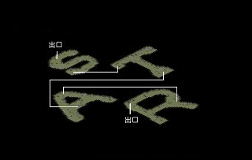
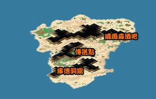
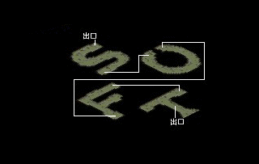
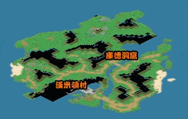

# 彩叶原之恋(练级区域及宠物获取)

<table><thead><tr><th width="126" align="center">起始地點</th><th width="231" align="center">雷歐娜村湯瑪斯長老家</th><th width="104" align="center">頭目戰</th><th>○</th></tr></thead><tbody><tr><td align="center">必要條件</td><td align="center">完成<a href="xiao-shi-de-wang-zi-cai-ye-yuan-qian-zhi.md">消失的王子任务</a></td><td align="center">必要等級</td><td>---</td></tr><tr><td align="center">職業限定</td><td align="center">---</td><td align="center">建議等級</td><td>LV100</td></tr><tr><td align="center">時間限制</td><td align="center">---</td><td align="center">重複完成</td><td>○</td></tr><tr><td align="center">任務獎賞</td><td align="center">人魔草LV1、翼龍LV1</td><td align="center"></td><td></td></tr></tbody></table>

<mark style="color:red;">**☆請參考「弗利德島」地圖**</mark>\

1.到雷歐娜村湯瑪斯長老家(69,54)，調查傳送石人(17,11)進入冰之神殿，從(18,35)的門出去抵達弗立德島冰之神殿域\
☆必須持有"長老家的鑰匙"才能進入

<table data-header-hidden><thead><tr><th width="355"></th><th></th></tr></thead><tbody><tr><td>弗立德島（冰之神殿） </td><td>庫德洞窟 </td></tr><tr><td>弗立德島（砂漠之地） </td><td>弗立德島（火炎之谷） </td></tr><tr><td>庫德洞窟 </td><td>弗立德島（漢米頓） </td></tr></tbody></table>

2.到(66,82)進入庫德洞窟，走出洞窟後到達弗利德島火炎之谷域。從(139,230)的魔法陣傳送到弗利德島砂之塔域，再由(92,101)進入庫德洞窟。通過洞窟後到達弗利德島漢米頓村域，從(86,159)進入漢米頓村\

3.從商城三樓(30,36)進入傳送石到商城閣樓，共15層

4.通過迷宮到達商城祕室，與巴克達手下交談進入戰鬥

<table><thead><tr><th width="116">名字</th><th width="73">數量</th><th width="74">等級</th><th width="128">血量(預估值)</th><th width="69">屬性</th><th>使用技能</th></tr></thead><tbody><tr><td>巴克達手下</td><td>1</td><td>115</td><td>7500</td><td> </td><td>攻擊、防禦、諸刃(歐奴奇美拉0隻追加)、乾坤一擲(歐奴奇美拉0隻追加)、吸血攻擊、混亂攻擊(二次行動)</td></tr><tr><td>歐奴奇美拉</td><td>4</td><td>110</td><td>5000</td><td> </td><td>攻擊、防禦、強力隕石魔法</td></tr></tbody></table>

戰勝後與湯瑪斯長老對話取得"長老的徽章"\
<mark style="color:red;">**☆以下的步驟每個人都需交出一個NPC要求的道具**</mark>\
　<mark style="color:red;">**三個部分沒有特定的順序，可以從任何一個先解**</mark>

<mark style="color:purple;">**△冰之神殿**</mark>

5.回到冰之神殿，和神官恰咪(40,42)說話交出"韓式泡菜飯"1個進入冰之神殿地下，通過15層的隨機迷宮到達神殿之底。與巴克達手下對話進入戰鬥

<table><thead><tr><th width="130">名字</th><th width="70">數量</th><th width="70">等級</th><th width="141">血量(預估值)</th><th width="71">屬性</th><th>使用技能</th></tr></thead><tbody><tr><td>巴克達手下</td><td>1</td><td>115</td><td>7500</td><td> </td><td>攻擊、防禦、乾坤一擲(二次行動)</td></tr><tr><td>艾德奇美拉</td><td>4</td><td>110</td><td>4000</td><td> </td><td>攻擊、防禦、隕石魔法、強力冰凍魔法</td></tr></tbody></table>

獲勝後跟露娜談話拿取"公主日記"

<mark style="color:purple;">**△砂之塔**</mark>

6.到弗利得島砂之塔域的威爾森酒吧(173,91)，與酒保奈特(47,32)交談交出1個"宇治金時"後進入砂之塔，通過15層的隨機迷宮到達塔之底。與巴克達手下交談觸發戰鬥

<table><thead><tr><th width="129">名字</th><th width="70">數量</th><th width="64">等級</th><th width="126">血量(預估值)</th><th width="69">屬性</th><th>使用技能</th></tr></thead><tbody><tr><td>巴克達手下</td><td>1</td><td>120</td><td>7500</td><td> </td><td>攻擊、防禦、乾坤一擲、混亂攻擊(二次行動)</td></tr><tr><td>歐特奇美拉</td><td>4</td><td>115</td><td>5000</td><td> </td><td>攻擊、防禦、風刃魔法、強力風刃魔法</td></tr></tbody></table>

戰勝後與智者魯迪交談得到"公主日記"

<mark style="color:purple;">**△火炎之谷**</mark>

7.再到弗利德島火炎之谷域，與若芙(189,208)對話交出"永久冰石"20單位後進入火炎之谷，共15層。通過迷宮後到達谷之底，與巴克達手下對話發生戰鬥

<table><thead><tr><th width="114">名字</th><th width="69">數量</th><th width="73">等級</th><th width="124">血量(預估值)</th><th width="69">屬性</th><th>使用技能</th></tr></thead><tbody><tr><td>巴克達手下</td><td>1</td><td>125</td><td>7500</td><td> </td><td>攻擊、防禦、乾坤一擲、混亂攻擊(二次行動)</td></tr><tr><td>依魯特奇美拉</td><td>4</td><td>120</td><td>5000</td><td> </td><td>攻擊、防禦、火焰魔法</td></tr></tbody></table>

獲勝後調查書堆獲得"公主日記"

9.回到漢米頓村，到商城三樓(18,32)找拉傑法爾說話，以三本"公主日記"換取"彩葉原通行證"

10.從德威特島(440,482)進入黃色傳送石到達殷紅的山谷，共20層。從頂層的傳送石出去到達彩葉原；和(28,59)的守衛對話傳送到吊橋的後半段\
<mark style="color:red;">**☆殷紅的山谷裡面，樹精會使用破壞裝備技能**</mark>\
　<mark style="color:red;">**與此處隨機出現的綠煙戰鬥後會隨機獲得"彩葉草苗"，作用為在皇后陵寢可以隨機遇到LV1的雛龍**</mark>

11.從(67,28)的黃色傳送石進入殷紅的山谷。通過20層的迷宮後到達皇后陵寢

12.到(63,41)處跟鎮墓獸說話進入戰鬥

<table><thead><tr><th width="105">名字</th><th width="65">數量</th><th width="96">等級</th><th width="129">血量(預估值)</th><th width="93">屬性</th><th>使用技能</th></tr></thead><tbody><tr><td>鎮墓獸</td><td>1</td><td>160</td><td>22000</td><td> </td><td>攻擊、防禦、遺忘魔法(10)、強力遺忘魔法(10)、戒驕戒躁(10)、裝備破壞(我方剩下1人時追加)(二次行動) </td></tr><tr><td>迷你龍</td><td>3</td><td>140~145</td><td>4000</td><td>地5水5</td><td>攻擊、防禦、冰凍魔法(10)、超強冰凍魔法(10)、超強混亂魔法(10)</td></tr><tr><td>雛龍</td><td>4</td><td>140~145</td><td>4000</td><td>水5火5</td><td>攻擊、防禦、火焰魔法(10)(針對遠武)、超強中毒魔法(10)</td></tr></tbody></table>

戰勝後傳送到陵墓入口。從樓梯進入王妃陵墓

13.通過約32層的迷宮抵達墓室。與痴心巴克達(21,61)交談發生戰鬥

<table><thead><tr><th width="153">第1回連續戰鬥</th><th width="71"></th><th width="102"></th><th width="128"></th><th width="76"></th><th></th></tr></thead><tbody><tr><td>名字</td><td>數量</td><td>等級</td><td>血量(預估值)</td><td>屬性</td><td>使用技能</td></tr><tr><td>痴心巴克達</td><td>1</td><td>189</td><td> </td><td> </td><td>攻擊、乾坤一擲、陽炎(二次行動)</td></tr><tr><td>八歧大蛇</td><td>4</td><td>180~185</td><td>4000</td><td>風6地4</td><td>攻擊、混亂攻擊(二次行動)</td></tr></tbody></table>

\

<table><thead><tr><th width="156">第2回連續戰鬥</th><th width="70"></th><th width="71"></th><th width="127"></th><th width="91"></th><th></th></tr></thead><tbody><tr><td>名字</td><td>數量</td><td>等級</td><td>血量(預估值)</td><td>屬性</td><td>使用技能</td></tr><tr><td>可麗兒皇后</td><td>1</td><td>200</td><td> </td><td> </td><td>攻擊、風刃魔法(R10)、強力遺忘魔法(二次行動)</td></tr><tr><td>墓中藤蔓</td><td>4</td><td>198</td><td>4000</td><td>水8火2</td><td>攻擊、混亂攻擊、酒醉攻擊</td></tr></tbody></table>

獲勝後調查皇后之棺(24,16)，以通行證換取"神秘的蛋"並傳送出去，任務完成\
<mark style="color:purple;">**☆"神秘的蛋"　經過三天後以滑鼠左鍵雙擊會孵化出LV1人魔草，經過十天後雙擊蛋才會孵化出LV1翼龍。時間未超過孵化所需最低時間蛋不會有反應。(以上均為現實世界時間；72小時後雙擊蛋出現沒有反應之訊息才是翼龍，不是經過十天就一定會孵化出翼龍)**</mark>
