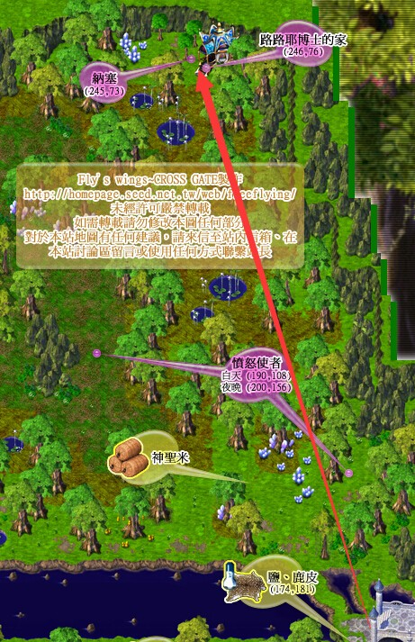

---
layout:
  title:
    visible: true
  description:
    visible: true
  tableOfContents:
    visible: true
  outline:
    visible: true
  pagination:
    visible: false
---

# 琥珀之卵系列任务（迅速果断/转职保证书等）

<mark style="color:purple;">**本系列任务可获得：**</mark>\
\
称号"魔界风水师"(闪躲+8)、血之耳环的仿造品、转职保证书、金块(1000G)、1级宠物"火焰翼龙"\
\
可学习技能：迅速果断\
可学习技能：毒击\
\
\
\
\
<mark style="color:red;">**一、琥珀之卵（建议等级20+）**</mark>\
\
1.前往艾尔莎岛神殿·伽蓝（200.96）三楼神殿·里侧大厅，至（48.60）处进入约尔克神庙。调查（39.21）处，获得【琥珀之卵】。\
◆本任务《琥珀之卵（卵1）》是获得【转职保证书】《神之召唤》（卵4）前置任务之一。有些玩家的角色可以直接做卵4，不需要做前置任务：《琥珀之卵（卵1）》任务和《魔导书抄本（卵3）》任务；\
\
\
2.前往艾夏岛查尔博士的家（133.77）与查尔博士（11.12）对话，获得【查尔的介绍信】。如果无法获得【查尔的介绍信】，则前往艾夏岛冒险者旅馆（102.115）与时空之人（30.20）对话，输入“安登”，再与查尔博士（11.12）对话可获得。\
◆任务是否完成判别方法：完成步骤1和2，如不能获得【查尔的介绍信】，则任务已完成；如能获得【查尔的介绍信】，则任务未完成\
\
\
3.前往盖雷布伦森林路路耶博士的家（244.76）与路路耶博士（8.8）对话，进入战斗。\
◆进入路路耶博士的家时队伍强制解散，若组队完成与路路耶博士的战斗可能会导致无法继续任务\
◆行走路线：\
\
\
\
4.战斗胜利后获得【路路耶的字典】，走出路路耶的家至盖雷布伦森林，任务完结。\
◆必须走出路路耶的家才算完成任务，否则在进行《神之召唤（卵4）》任务时，必须重解此任务\
◆任务完成并走出路路耶的家以后，可丢弃【路路耶的字典】；【琥珀之卵】不建议丢，后续任务还需要\
◆若已完成《魔导书抄本（卵3））任务则传送至？？？\
\
\
\
<mark style="color:red;">**二、魔界风水师**</mark><mark style="color:red;">（独立任务 可略过）</mark><mark style="color:red;">**（建议等级50+）（宠物大师可以学习变身技能）**</mark>

\
1.持有任意一把5级以上的【小刀】（含5级）前往法蓝城遗迹与破破烂烂的神官？（143.101）对话，进入战斗。\
◆5级以上的【小刀】可向NPC购买：\
杰诺瓦镇（43.23）杂货店-2层-装备品店-阿斯塔利，枪型小刀，Lv.5，30000G\
\
2.战斗胜利后队伍中随机一人取得【小刀？】，鉴定后为【断头蛇状匕首】（5级）。\
\
3.前往梅布尔隘地（149.134）双击使用【断头蛇状匕首】，移动一步后进入出现的洞口（150.133）到达罪之房。\
◆【断头蛇状匕首】只需使用一次，该人物以后便可直接进入罪之房。\
\
4.第一层（179.86）→第二层（141.55）→第三层\
\
5.在第三层与封印者（252.187）对话，进入战斗。\
\
6.战斗胜利后传送至前主教威普尔处，使用3级变身技能变成腐尸并与其对话，随机获得【坏掉的风水盘A\~D】其中之一、【琥珀之卵】。\
◆将【坏掉的风水盘】存放银行或者交给他人保管后，重复步骤3\~5收集齐【坏掉的风水盘A、B、C、D】\
\
\
7.前往艾夏岛克罗莉的店（150.125）与荷特普（47.19）对话，交出1000G修理【坏掉的风水盘】获得【魔界风水盘】，任务完结。\
◆双击【魔界风水盘】获得称号“魔界风水师”； 【魔界风水盘】可以交易。\
◆持有该称号及对方图鉴，就能在战斗中得知对方属性强弱\
◆如若荷特普不修理坏掉的风水盘，请去时空之人处对话输入“贝尔达”回到琥珀之卵1任务完成后的状态。\
\
\
\
\
<mark style="color:red;">**三、魔导书抄本（建议等级50+）**</mark>\
\
1.前往艾尔莎岛神殿·伽蓝（200.96）三楼神殿·里侧大厅，至（48.60）处进入约尔克神庙。调查(39.21)处，获得【琥珀之卵】。\
◆若持有【琥珀之卵】，此步可省略\
\
2.前往梅布尔隘地与马汀斯(170.120)对话进入战斗。\
◆Lv.20马汀斯，血量约650；技能：攻击、防御、攻击反弹、魔法反弹、补血魔法\
\
3.战斗胜利后队伍中随机一人获得【魔导书抄本】。\
◆从此步开始，由得到【魔导书抄本】的人带队，第4\~7步全部由持有该道具的人带队\
◆【魔导书抄本】仅需一人获得即可，不需要每个人都有\
\
4.前往盖雷布伦森林与纳塞(245.73)对话，选“是”。\
◆选否【魔导书抄本】会被收走，需重新接任务\
\
5.至神殿·伽蓝与荷特普(92.138)对话，选“是”。\
◆选否【魔导书抄本】会被收走，需重新接任务\
\
6.前往艾夏岛冒险者旅馆(102.115)与安洁可(55.32)对话选“是”。\
◆若没有出现选项请检查之前步骤是否全部完成\
\
7.前往布拉基姆高地（203.265）处附近虫洞，寻找迷宫内随机出现的纳塞并与之对话，选“是”传送至？？？。\
◆虫洞为随机迷宫，约8层；魔物为Lv.29\~34舞蹈花妖、碎碎地雷\
◆若没有出现选项请检查之前步骤是否全部完成\
\
8.与玄武(195.32)对话，选择“是”进入战斗。\
◆BOSS：Lv.20玄武，血量约2000；技能：攻击、防御、乾坤一掷、陨石魔法、石化攻击、混乱攻击\
\
9.战斗胜利后与玄武对话。通过（230.57）处黄色传送石返回布拉基姆高地。\
◆每名队员都必须与玄武对话，否则之后无法与安洁可进行战斗\
◆与那塞(232.57)对话，可交出<mark style="color:red;">**100000G学习技能迅速果断**</mark>；与果本(228.57)对话，可交出<mark style="color:red;">**100000G学习技能毒击**</mark>\
\
10.再次前往虫洞，通过随机迷宫抵达？？？。夜晚或清晨与安洁可(50.113)对话进入战斗。\
\
11.战斗胜利后随机获得【耳环？】或【金块？】。\
◆【耳环？】鉴定后为【血之耳环的仿造品】（Lv.1耳环、耐久4；牺牲生命值来增加魔力值；可以交易），贩店价500G；\
【金块？】鉴定后为【活动资金】，贩店价1000G\
\
\
12.与荷特普（131.100）对话，交出【魔导书抄本】并传送回布拉基姆高地，任务完结。\
◆每名队员都得与荷特普对话才算任务完成\
◆前往艾夏岛冒险者旅馆(102.115)与时空之人(30.20)对话，输入“贝尔达”，选“是”可重置本任务\
\
\
\
\
\
<mark style="color:red;">**四、神之召唤（建议等级50+）**</mark>\
\
1.前往艾尔莎岛神殿·伽蓝（200.96）三楼神殿·里侧大厅，至（48.60）处进入约尔克神庙。调查（39.21）处，获得【琥珀之卵】。\
◆若持有【琥珀之卵】，此步可省略\
\
\
2.前往盖雷布伦森林路路耶博士的家（244.76），进入后再离开路路耶博士的家并传送至？？？。\
◆需要完成前置任务《琥珀之卵（卵1）》任务和《魔导书抄本（卵3）》\
◆若无法传送至？？？，在艾夏岛冒险者旅馆（102.115）内与时空之人（30.20）对话，输入“朵拉”选“是”，再选“确定”可重置本任务\
\
\
3.通过（142.69）或（122.69）处黄色传送石进入海底墓场外苑，寻找随机出现的守墓员并与之对话进入战斗。\
◆战斗结束后等待若干时间再与该守墓员交谈可重新进入战斗。\
\
\
4.战斗胜利随机获得【长老之证】\*0\~3。\
◆【长老之证】**登出回城消失、不可交易，不可丢地**\
\
\
5.集齐7个【长老之证】后返回？？？，由持有7个【长老之证】的队员与荷特普（167.102）对话2次，选“是”交出【长老之证】并传送至盖雷布伦森林。\
◆只要有1个队员有7个【长老之证】即可\
\
\
6.至神殿•伽蓝与荷特普（92.138）对话。前往艾夏岛冒险者旅馆（102.115）与安洁可（55.32）对话，获得【逆十字】。\
\
\
7.前往梅布尔隘地，持有【琥珀之卵】、【逆十字】与祭坛守卫（211.116）对话进入？？？。\
◆行走路线：\
\
\
\
\
8.击倒（136.197）一带的阻挡者后，进入（156.197）的传送石。\
◆阻挡者在短时间内会重生，请注意不要随便走动\
◆行走路线（如果选择错误 障碍物不会消失）\
\
\
9.在该地图击败随机出现的阻挡者时，有20%几率被传送。(被击败的阻挡者3分钟后会再次刷新)\
\
\
10.击倒（161.108）一带的阻挡者，经由（243.117）的传送石进入？？？。\
◆阻挡者在短时间内会重生，请注意不要随便走动\
◆行走路线（如果选择错误 障碍物不会消失）\
\
\
11.与昏神祭司(222.188)对话，选“否”进入战斗。\
\
12.战斗胜利后，传送至梅布尔隘地（211.116），队伍中随机一人获得【觉醒的文言抄本】。\
◆【觉醒的文言抄本】，可交易，丢地不消失\
\
13.返回盖雷布伦森林，持有【觉醒的文言抄本】与纳塞（245.73）对话，获得【转职保证书】（不可交易）（每人仅可获得一次）。\
◆【觉醒的文言抄本】不会交出，全队可以共用一个【觉醒的文言抄本】\
◆持有【转职保证书】进行转职时，战斗系和生产系可保留人物全部技能等级，但超过上限等级的技能无法使用\
\
\
\
\
**五、古代支配者（建议等级50+）**\
\
1.黄昏或夜晚前往法兰城遗迹（83.36）、（63.87）、（167.86）、（133.74）四处进入战斗（请勿组队战斗），战斗胜利后30%几率获得【精灵之牙？】。◆【精灵之牙？】每名队员都需要持有\
◆ 不能继续触发战斗时 小退在进入即可，请注意原地登录次数\
\
\
**注意！！一定要换成最后一名队员持有【觉醒的文言抄本】！！**\
然后队长走到雕像面前坐标 即可进入昏神的领域，其余队员再重新组队，依此方法直至全部进入昏神的领域\
2.前往神殿·伽蓝二楼精灵之下宫，持有【觉醒的文言抄本】、【精灵之牙？】调查四个属性的雕像，交出【精灵之牙？】传送至地之昏神的领域。\
\
◆昏神的领域行走线路图：\
\
\
\
3.前往昏神的领域（166.79）处，按顺序击倒各领域的使者后进入昏神的领域——内宫，与昏神对话传送至下一个领域。\
\
4.与风之领域风的哈斯塔对话，传送至？？？。通过（166.141）处传送石进入四昏神的领域，从底层的传送石传送至？？？。\
\
5.与阿布荷斯主教（67.171）对话，交出【觉醒的文言文抄本】，进入战斗。\
◆若未持有【觉醒的文言文抄本】与阿布荷斯主教对话会传回精灵之下宫，可重接第1步\
\
6.战斗胜利后传送至四昏神的领域——内宫，与安洁可（68.49）或阿布荷斯主教（69.51）对话再次进入战斗。\
\
7.战斗胜利后，队伍中随机1人获得【阿布荷斯的逆十字】，0\~2人获得【金块？】并传送回精灵之下宫，任务完结。\
◆【金块？】鉴定后为【活动资金】，卖店价1000G\
\
8.持有“阿布荷斯的逆十字”与盖雷布森林的"纳塞"对话。（第六章任务需要）\
\
\
\
◆在艾夏岛冒险者旅馆（102.115）内与时空之人（30.20）对话，输入“爱蜜儿”，选2次“是”，可重置本任务\
\
\
\
\
**六、异界之神（建议等级120+）**\
\
1.前往艾夏岛(102.115)冒险者旅馆，持有【阿布荷斯的逆十字】与克罗（22.44）对话。\
◆队伍中只需一人持有【阿布荷斯的逆十字】与克罗对话即可\
◆需要完成第四章第13步和第五章第8步\
\
2.与冒险者旅馆安洁可（55.32）对话，交出【地底仙人掌的刺】获得【神秘鸡尾酒】。\
◆【地底仙人掌的刺】获得方式：     1、勇者大厅商店区-特殊物品NPC购买 仙人掌肥料\*1\
&#x20;    2、从梅布尔隘地（255.166）处进入布拉基姆高地东南侧，通过（204.264）处黄色传送石进入虫洞。\
&#x20;    3、通过随机迷宫进入最底层，持有【仙人掌肥料】调查地底仙人掌（52.110），获得【地底仙人掌的刺】。\
\
\
3.双击【神秘鸡尾酒】传送至 ？？？。前往（79.125）或（64.168）处黄色传送石进入心伤者的避难所，击倒随机出现的魔物收集5个【冻结的悲鸣】。\
◆【冻结的悲鸣】无法用偷窃技能获得\
\
4.队长持有5个『冻结的悲鸣』后回 ？？？，与安洁可交谈选「是」传送到神殿·伽蓝。调查神殿·伽蓝(156.96)，冰冻的悲鸣消失，进入撕裂的空间（即拉·梵·琉）。\
◆撕裂的空间第一、二、三层行走路线图：\
第一层：\
\
\
\
第二层：\
\
\
\
\
第三层：\
\
\
\
5.前往撕裂的空间第一层（257.103）处进入第二层，至第二层（130.156）处下楼进入第三层；至（119.120）处传送，与纳塞（257.103）对话，无论选“是”或“否”皆进入战斗。\
\
\
6.战斗胜利后，至第三层（130.126）处下楼进入第四层。\
◆撕裂的空间第四、五层行走路线图：\
第四层：\
\
\
\
第五层：\
\
\
\
7.按顺序至第四层（189.48）处传送至（212.110）进入第五层，至（168.135）处进入第四层，至（168.115）处进入第三层，至（177.116）处进入第二层，至（162.185）处进入第一层，至（138.194）处进入第二层，至（142.124）处进入第一层。\
\
\
8.与安洁可（175.125）对话，进入战斗。\
注意：此处需要转生证明的玩家，必须单人进入战斗（可带佣兵）\
\
9.战斗胜利后传送至？？？，队伍中随机一人获得【安洁可的逆十字】（不可交易），与纳塞对话传送至艾尔莎岛（195.99）处。\
\
10.前往盖雷布伦森林与纳塞（245.73）对话,持有【安洁可的逆十字】获得Lv.1火焰翼龙，任务完结。\
◆前往艾夏岛冒险者旅馆（102.115）与时空之人（30.20）对话，输入“弗里德里希”，选2次“是”可重置本任务\
\
\

