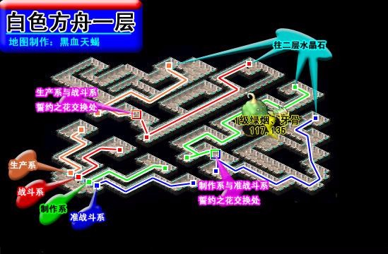
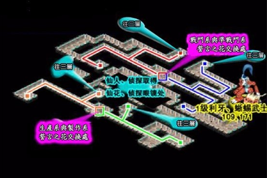
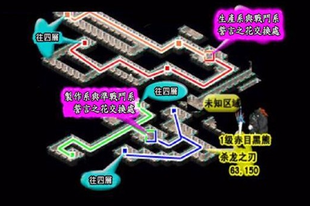
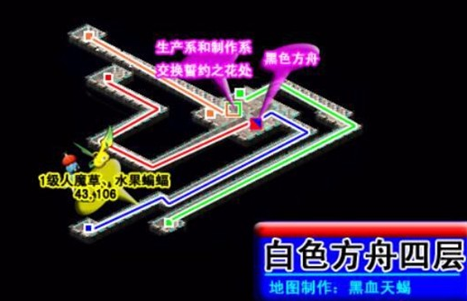

---
layout:
  title:
    visible: true
  description:
    visible: true
  tableOfContents:
    visible: true
  outline:
    visible: true
  pagination:
    visible: false
---

# 誓言之花（职业4转/黑龙/11格技能栏）

<table data-header-hidden><thead><tr><th width="120" align="center"></th><th></th><th></th><th></th></tr></thead><tbody><tr><td align="center">昵称</td><td>战斗系4转/生产系4转</td><td>任务类型</td><td>职业晋阶任务</td></tr><tr><td align="center">所属地图</td><td>光之路</td><td>任务NPC</td><td>石碑</td></tr><tr><td align="center">建议等级</td><td>95 级</td><td>可否重做</td><td>可重做</td></tr><tr><td align="center">必要条件</td><td>职业达到师范/御用阶段</td><td></td><td></td></tr></tbody></table>

\
<mark style="color:purple;">**详情**</mark>

\
**前往光之路调查（165.81）处石碑，选“是”进入白色方舟第一层。与守卫对话，进入白迷宫一层 然后可以根据本帖最下面地图走到黑迷宫**\
◆光之路抵达方式参考任务最后光之路抵达方式\
◆完成本任务后，符合晋阶条件者与就职NPC对话，交出40000G提升职业阶段；四转后，部分职业装备上限与技能上限提升\
◆光之路行走路线：\
\
\
◆战斗信息：\
Lv.125暗黑龙，血量约30000，邪魔系，属性：全25，抗咒；技能：防御、连击舞LV4、诸刃Ⅴ、混乱攻击Ⅳ、超强昏睡魔法LV3、明镜止水Ⅲ（HP<25%追加）召唤猫脸女神（队伍超过一个单位时追加）、召唤猫队长（队伍超过一个单位时追加）\
Lv.95猫脸女神\*4\~5，血量约1500，不死系，属性：水100，不抗咒；技能：四属性单体魔法（HP多者）、四属性强力魔法、自爆（全体伤害）\
Lv.95猫队长\*4\~5，血量约1500，不死系，属性：火100，不抗咒；技能：诸刃、乾坤一掷、圣盾、戒骄戒躁、自爆（全体伤害）

\
**战斗胜利后，队伍中随机一人获得【龙心】。通过黑色方舟底层传送石抵达白色方舟，由持有【龙心】的队员带队与目送者（150.78）对话，再与露比（99.15）对话选“是”，交出【誓言之花】并传送回光之路，获得晋阶资格，任务完结。**\
◆已四转人物再重解本任务，至第6步与露比对话切换地图，与传授者（64.60）对话传送，再与唤醒者（51.132）对话，技能栏上限增加至11格，再与唤醒者对话传送回光之路

\
**抓宠路线：**\
\
1、进入白色方舟第一层时 与“抓宠路线”NPC对话\
2、花费100000G传送到白色方舟\
**可捕捉1级宠物有：**\
绿烟、牙骨、利牙、蜥蜴武士、赤目黑熊、杀龙之刃、人魔草、水果蝙蝠\
\
**光之路抵达方式：新城可以通过 里谢里堡进入 或者 法兰城南门喷泉的飞象到丘斯特村**\
飞象路线：\
1.前往利夏岛与飞象使（118.101）对话，交出300G乘坐飞象前往丘斯特村。\
◆飞象一次可搭乘2名玩家，中间有一小段过场画面2.抵达丘斯特村后与港湾管理员（131.88）对话，交出500G乘坐修拉特瓦尔号前往辛梅尔。\
◆丘斯特村行走路线：

3.通过（207.93）处蓝色传送石抵达光之路。\
◆辛梅尔行走路线：\
\
【王冠】路线：\
1.前往利夏岛国民会馆（90.99），通过（108.41）处黄色传送石进入雪拉威森塔1层。\
2.持有【王冠】与托比子（35.95）对话，传送至辛梅尔。\
◆【王冠】获得方式参考《圣域守护者》任务3.通过（207.93）处蓝色传送石抵达光之路。\
◆辛梅尔行走路线：\
\
\
\--------白迷宫地图----------\
1层\
\
\
2层\
\
\
\
\
3层\
\
\
\
4层\
\
