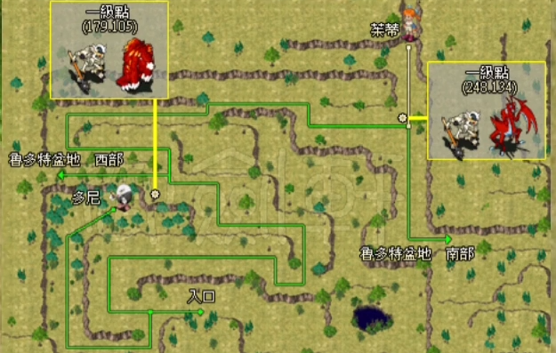
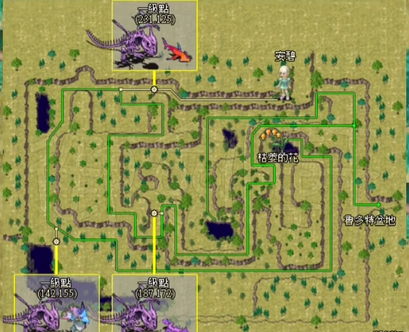
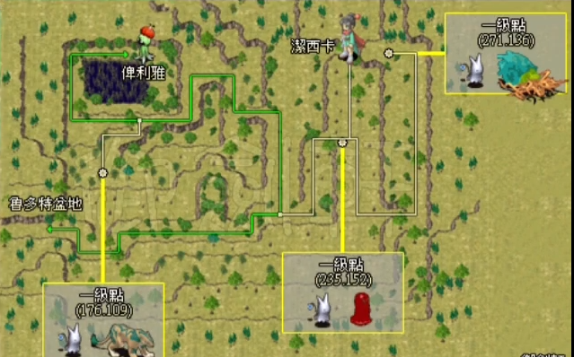
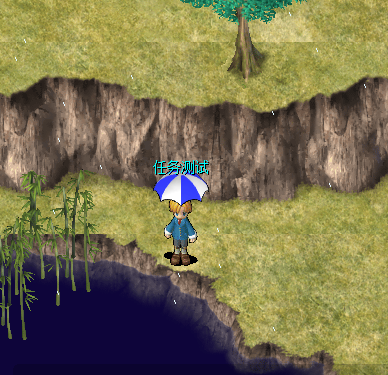

---
layout:
  title:
    visible: true
  description:
    visible: true
  tableOfContents:
    visible: true
  outline:
    visible: true
  pagination:
    visible: false
---

# 鲁多特盆地（方堡盆地/雨伞头饰/1级宠）

"盖雷布伦森林" 215,43 找"攀岩专家罗奇"对话进入"鲁多特盆地"\
\
"鲁多特盆地"163,77 进入"鲁多特盆地·西"\
\
\
"鲁多特盆地"228,178 进入"鲁多特盆地·南"\
\
\
"自由的小雨伞"头饰获得方法：\
&#x20;   1、盆地西 找"枯萎的花"对话\
&#x20;   2、盆地南 找"俾利雅"对话\
&#x20;   3、盆地西 198,193 触发对话\
&#x20;   4、盆地南 找"俾利雅"对话\
&#x20;   5、盆地找 找"多尼"对话\
\
\
"鲁多特盆地"简略图及宠物1级点：\
\
\
"鲁多特盆地·西"简略图及宠物1级点：\
\
\
"鲁多特盆地·南"简略图及宠物1级点：\
\
\
\
\
头饰："自由的小雨伞"\
1级|耐久300|攻击15|防御15|敏捷15|生命魔力100|精神5|防御5|魔攻15|四修正5|\

