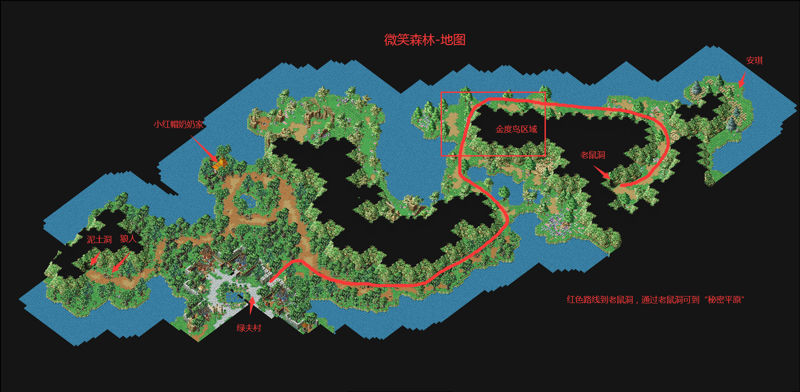
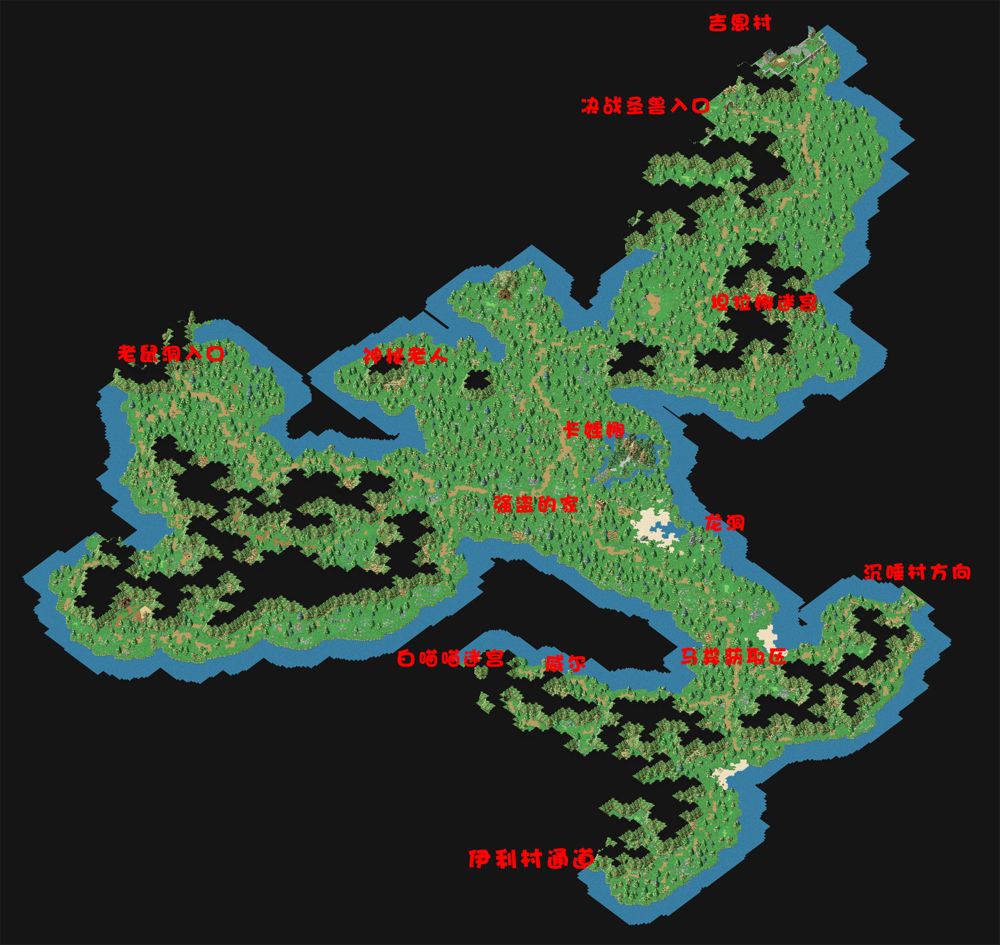
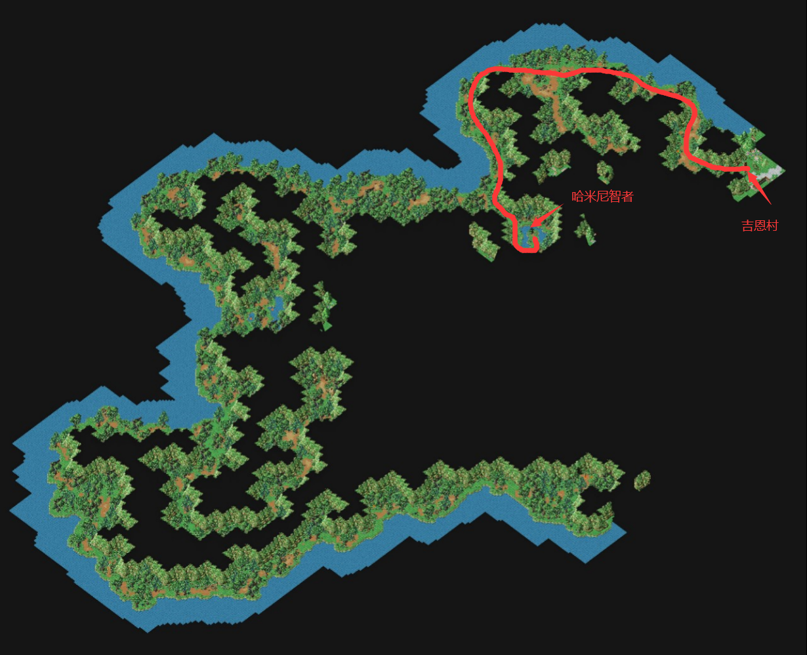
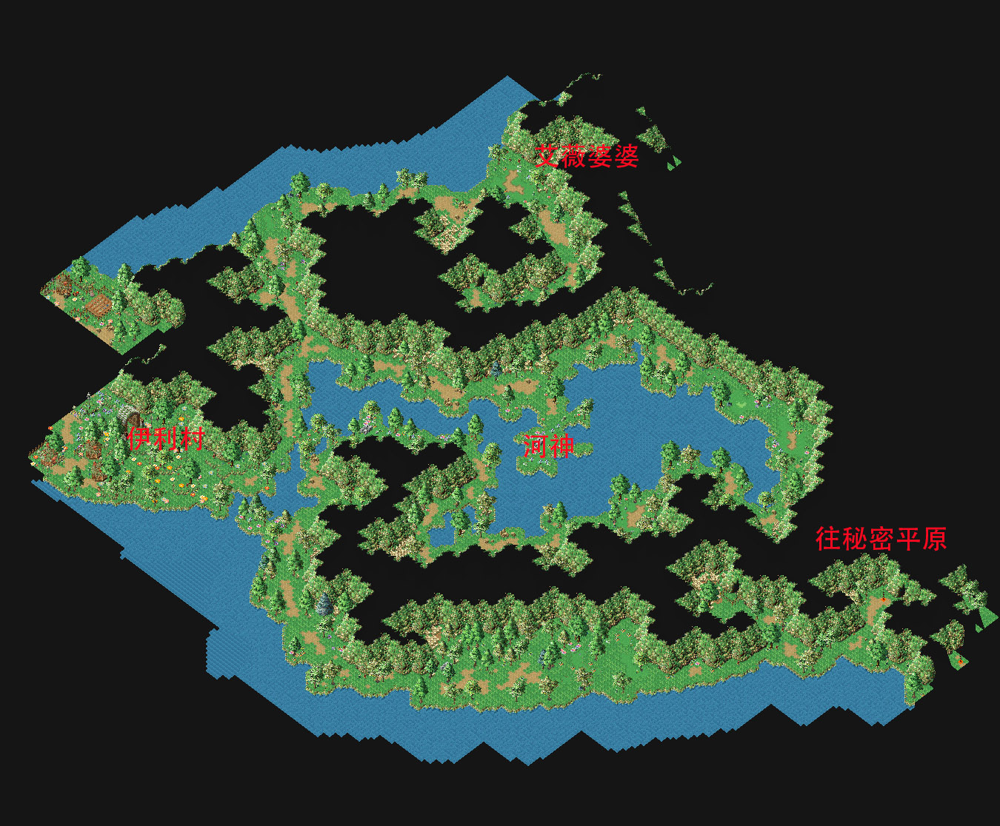
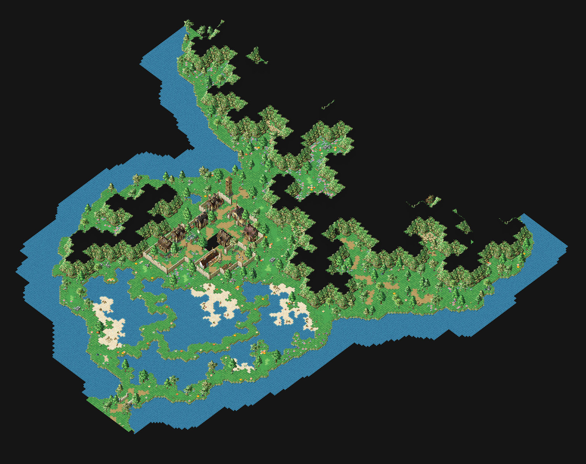

# 童话王国系列任务

**注意：相关地图在本攻略最下方！！！注意：相关地图在本攻略最下方！！！注意：相关地图在本攻略最下方！！！**\

<table data-header-hidden><thead><tr><th width="165" align="center"></th><th></th></tr></thead><tbody><tr><td align="center"></td><td>                                         <mark style="color:green;"><strong>1.0 童话王国 系列任务</strong></mark></td></tr><tr><td align="center"></td><td></td></tr><tr><td align="center"><strong>绿夫村任务</strong></td><td><a href="tong-hua-wang-guo-1.0/tong-hua-wang-guo-1.0lfu-cun.md">点击查看系列任务攻略</a></td></tr><tr><td align="center"><strong>微笑森林任务</strong></td><td><a href="tong-hua-wang-guo-1.0/tong-hua-wang-guo-1.0-wei-xiao-sen-lin.md">点击查看系列任务攻略</a></td></tr><tr><td align="center"><strong>吉恩村任务</strong></td><td><a href="tong-hua-wang-guo-1.0/tong-hua-wang-guo-1.0-ji-en-cun.md">点击查看系列任务攻略</a></td></tr><tr><td align="center"><strong>伊利村任务</strong></td><td><a href="tong-hua-wang-guo-1.0/tong-hua-wang-guo-1.0-yi-li-cun.md">点击查看系列任务攻略</a></td></tr><tr><td align="center"><strong>沉睡村任务</strong></td><td><a href="tong-hua-wang-guo-1.0/tong-hua-wang-guo-1.0-chen-shui-cun.md">点击查看系列任务攻略</a></td></tr><tr><td align="center"><strong>金银谷任务</strong></td><td><a href="tong-hua-wang-guo-1.0/tong-hua-wang-guo-1.0-jin-yin-gu.md">点击查看系列任务攻略</a></td></tr><tr><td align="center"><strong>秘密平原任务</strong></td><td><a href="tong-hua-wang-guo-1.0/tong-hua-wang-guo-1.0-mi-mi-ping-yuan.md">点击查看系列任务攻略</a></td></tr><tr><td align="center"> </td><td></td></tr><tr><td align="center"></td><td>                                          <mark style="color:green;">  <strong>2.0 人鱼传说 系列任务</strong></mark></td></tr><tr><td align="center"><strong>贪玩的小美人鱼</strong></td><td> <strong>建议等级：</strong>100级以上 <strong>重复任务：</strong>不可 <strong>BOSS：</strong>无 <strong>奖励：</strong>3500魔币 <strong>任务流程：</strong> 1. 任务开始传送吉恩村，过去趴趴迷宫较近（100-105级怪  怪物2000-2500血） 1. 秘密平原（519,455）进入趴趴迷宫，到趴趴迷宫1F(49.6)进入秘密基地找小美人鱼 2. 再去趴趴迷宫1F（6,23） 进入2楼，38,49 进入女巫的家交谈。 3. 分别在趴趴迷宫打水居蟹的触须X10和海鳐的卵X10 4. 收集好材料跟女巫换药，把药拿回去给小美人鱼（身上千万背带超过100W魔币，否则重新打道具）  </td></tr><tr><td align="center"><strong>相思病</strong></td><td> <strong>建议等级：</strong>100级以上 <strong>重复任务：</strong>不可 <strong>BOSS：</strong>无 <strong>奖励：</strong>4000魔币 <strong>备注：</strong>需完成贪玩的小美人鱼任务 <strong>任务流程：</strong> 1. 到趴趴迷宫1F(49.6)进入秘密基地找小美人鱼接任务 2. 美人鱼会告诉你他现在的心理和他想拜托你的事~你将会收到人鱼公主的相片 3. 将相片交给贝伯港比特任务结束   注：贝伯港到达方法，趴趴迷宫2F（64,22）上楼梯到达。  </td></tr><tr><td align="center"><strong>恋爱的心情</strong></td><td> <strong>建议等级：</strong>100级以上 <strong>重复任务：</strong>不可 <strong>BOSS：</strong>无 <strong>奖励：</strong>4500魔币 <strong>备注：</strong>需完成相思病任务 <strong>任务流程：</strong> 1. 解完相思病後再到趴趴迷宫里的秘密基地一次，找小美人鱼 2. 小美人鱼又有另一个烦恼要你帮忙解决~为了熟悉比特~小美人鱼拜托你向比特询问3个问题 3. 跟比特对话时在输入框输入问的问题。 第一题:你喜欢吃的水果是什么 第二题:你喜欢什么颜色 第三题：你喜欢什么宠物(每个任务都要回报一次~来回跑3次，这对狗男女自己问不好吗？) 4、最后回去跟小美人鱼领赏！  </td></tr><tr><td align="center"><strong>自由意志</strong></td><td> <strong>建议等级：</strong>100级以上 <strong>重复任务：</strong>不可 <strong>BOSS：</strong>无 <strong>奖励：</strong>5000魔币 <strong>备注：</strong>需完恋爱的心情任务/水龙料理X5、鳖料理X5和生命力回复药(1000) X5 <strong>任务流程：</strong> 1.再去小美人鱼那里她会要你把情书交给比特 2.把信交给贝伯港的比特之後得知他无法跟在海底的小美人鱼在一起，再回去跟小美人鱼讲 3.小美人鱼会要你找女巫去做恋爱神水给比特喝(来这招 ... = =) 4.找到女巫，女巫说她心情不好要你去收集水龙料理X5、鳖料理X5和生命力回复药(1000) X5 5.收集完之後女巫也心情好多了，给你做了恋爱神水 (可以先拿好再找她，免得又要回去再下来) 6.得到恋爱神水後回去给比特喝，比特喝完肚子痛（不靠谱的，纯属一个潘金莲啊，之后有讲）再回去找小美人鱼 。 7.最後找到小美人鱼得知原来是女巫弄错药水，虽然她很难过但还是谢谢你的帮忙，得到奖励任务结束  <strong>注1：水龙料理可以在商店区魔币购买，或者打海神获得原材料自行制作</strong></td></tr><tr><td align="center"><strong>顺其自然</strong></td><td> <strong>建议等级：</strong>100级以上 <strong>重复任务：</strong>不可 <strong>BOSS：</strong>无 <strong>奖励：</strong>8000魔币 <strong>备注：</strong>需完成自由意志任务/10级蓝宝石*1/<strong>金针菇1级宠（秘密平原304,179~491,512）</strong> <strong>任务流程：</strong> 1.同小美人鱼对话，因为上次害比特闹肚子痛所以要你抓支金针菇（1级）送给比特 2.抓到金针菇後送给比特，但比特并不愿意跟小美人鱼做男女朋友并叫你转告给小美人鱼 3.小美人鱼知道後并不放弃并要你再送一颗蓝宝石（10级宝石）给比特(我们真是滥好人呀 ... 自掏腰包) 4.再送给比特一颗蓝宝石（10级宝石）之後他会告诉你其实他不会游泳的烦恼，也终於愿意考虑看看跟小美人鱼在一起的事了(还好 ... 不然不知道又要浪费多少钱了) 5.回去跟小美人鱼，她会感谢你的帮忙 ~ 任务也到此结束罗 备注，准备好金针菇1级，蓝宝石10级，直接与比特对话2次得到“比特的信”，直接找美人鱼交任务。  </td></tr><tr><td align="center"><strong>不会游泳的真相</strong></td><td> <strong>建议等级：</strong>100级以上 <strong>重复任务：</strong>不可 <strong>BOSS：</strong>无 <strong>奖励：</strong>10000魔币 <strong>备注：</strong>需完成顺其自然任务/青岛啤酒*1 <strong>任务流程：</strong> 1.小美人鱼要你去贝伯港找华卓斯（13 16）问比特不会游泳的原因 2.找到华卓斯他会跟你要一瓶青岛啤酒 3.把酒给他之後他会告诉你比特的事，并叫你去找克莱儿，她在贝伯港的港务室 4.克莱儿要你跟他猜拳（猜拳是随机的），猜赢了她才帮你(只要你输入石头、剪刀、布， ~ 反正输了可以再猜，输了可是要扣5000魔币)，赢了之後她会给你一个游泳圈叫你拿给小美人鱼 5.回去找小美人鱼得到奖励任务结束 ~    <strong>备注1：提前在吉利村购买好青岛啤酒。</strong> <strong>备注2：猜拳有小秘密，输了可以不扣5000魔币，自行研究！！！</strong>  </td></tr><tr><td align="center"><strong>种族的隔阂</strong></td><td> <strong>难度：</strong>困难 <strong>建议等级：</strong>100级以上，5 <strong>重复任务：</strong>不可 <strong>BOSS：</strong>有 <strong>奖励：</strong>无 <strong>备注：</strong>需完成不会游泳的真相任务/莱姆骑士矿条*40  灵草*40  鱼翅*40 <strong>任务流程：</strong> 1.小美人鱼会告诉你她爸爸人鱼国王反对他们交往 2.来到史盖窝克海（注1），但在进入海王宫门口遇到守卫阻拦（注2），找人鱼国王可他却不肯答应 3.再继续往里面走问问人鱼皇后的意见，她会说只要比特喝下人鱼变身剂她就愿意比特和小美人鱼交往得到配方 （<mark style="color:red;">注意做到这一步，即可去做《横刀夺爱》的重复任务，如果做完本任务，将无法重复做横刀夺爱任务</mark>） 4.跑到女巫那边去把配方及配方上注明的材料给她(哇 ~ 真不想给呀)来完成人鱼变身剂，给她之後拿到人鱼变身剂赶快回到岸上给比特喝 5.给贝伯港的比特喝完任务结束  <strong>注1：微笑森林（164 52）附近</strong> <strong>注2：守卫为BOSS，110级的巨鲨</strong>   <strong>注3：人鱼变身剂配方，莱姆骑士矿条*40  灵草*40  鱼翅*40</strong>  </td></tr><tr><td align="center"><mark style="color:red;"><strong>横刀夺爱</strong></mark> <mark style="color:purple;">注意《种族的隔阂》做到第三步即可接本任务，如果做完本任务不可重复</mark></td><td> <strong>难度：</strong>困难 <strong>建议等级：</strong>100级以上，5 <strong>重复任务：</strong>可 <strong>BOSS：</strong>有 <strong>奖励：BOSS随机掉落</strong> <mark style="color:green;">1、章鱼大魔王的尸骨3~5个(每个可换取章鱼烧*1 随机5-7级宠物装备*1)</mark> <mark style="color:green;">2、定海神珠（小概率）</mark> <mark style="color:red;"><strong>备注：</strong>需完成不会游泳的真相任务，但不要把种族的隔邸任务做完，不然无法接和重复接任务了</mark> <strong>任务流程：</strong> 1.人魚國王已经早把小美人鱼许配给章鱼大魔王 2.比特會拜託你去害怕峡谷的巴斯密洞（541,306）打倒章魚大魔王(苦差事都是我們來就對了 ...)（大魔王随机掉落定海神珠） 4.來到巴斯密洞，在迷宫隨機會碰到章魚大魔王（随机NPC形式），打敗他之後後就可以跟比特回報囉 5.比特感謝你幫他解決了這一大阻礙，任務完成    <mark style="color:red;"><strong>定海神珠</strong></mark><strong>：</strong>1级水晶|耐久300-500 |纯水| (攻1-50 or 魔攻1-50)|防御1-50|敏捷1-50|生命魔力1-200|抗魔1-50|四修正1-5  </td></tr><tr><td align="center"><strong>意外的结局</strong></td><td> <strong>难度：</strong>简单 <strong>建议等级：</strong>100级以上，5 <strong>重复任务：</strong>不可 <strong>BOSS：</strong>无 <strong>奖励：</strong>5000魔币 <strong>备注：</strong>需完成种族的隔阂任务 <strong>任务流程：</strong> 1.小美人鱼要你去看比特变身了没（可略过） 2.跟比特说完话之後再去找女巫 3.女巫会告诉你比特无法变成人鱼并要你去问小美人鱼真正的心意 4.晴天霹雳 ... 小美人鱼告诉你她已经不喜欢比特了 = = (哇咧@$@^@$!#!#) 她要去找真正的王子 (拜金呀 ...) 5.回去跟比特说明这悲伤的消息 ... 这一连串的任务也终於结束了 ...    </td></tr><tr><td align="center"></td><td>                                              <strong> </strong><mark style="color:green;"><strong>3.0 爱丽丝梦游仙境 系列任务</strong></mark></td></tr><tr><td align="center"><strong>任务</strong></td><td> 1、寻找爱丽丝 2、忙碌的迟到兔 3、疯狂女伯爵 4、悲情的士兵 5、大逃亡  <a href="tong-hua-wang-guo-3.0-ai-li-si-meng-you-xian-jing.md">>>点击查看详细攻略&#x3C;&#x3C;</a>  </td></tr><tr><td align="center"><strong>任务奖励</strong></td><td> <strong>魔币、</strong><mark style="color:purple;"><strong>随机6-8级宠物装备</strong></mark> <strong>白宝石戒指</strong>（10级戒指 <mark style="color:red;"><strong>可交易</strong></mark>）： 200耐|攻击防御敏捷精神回复抗魔魔攻10-50|生命魔力10-200|六抗1-15|四修正1-15 <strong>孔雀石项链</strong>（10级项链 <mark style="color:red;"><strong>不可交易</strong></mark>）： 200耐|攻击防御敏捷精神回复抗魔魔攻10-50|生命魔力10-200|六抗1-15|四修正1-15  </td></tr><tr><td align="center"></td><td>                                               <mark style="color:green;"><strong>4.0 一千零一夜 系列任务</strong></mark></td></tr><tr><td align="center"><strong>任务</strong></td><td> 1、阿里巴巴和四十大盗 2、阿拉丁与小公主席拉 3、辛巴达历险  <a href="tong-hua-wang-guo-4.0-yi-qian-ling-yi-ye.md">>>点击查看详细攻略&#x3C;&#x3C;</a>  </td></tr><tr><td align="center"><strong>任务奖励</strong></td><td> <strong>宠物装备8~10级</strong> 金项链（不可交易）|6级项链|150耐久|攻击魔力50~200|回复魔抗魔攻10~100|六抗性10~20|四修正5~10 金戒指（不可交易）|6级戒指|150耐久|攻击防御敏捷精神5~10|四修正5~10 爱的祝福（不可交易）|6级护身符|150耐久|攻击10~80|防御10~80|敏捷10~80|精神10~80|回复10~80 火琵琶（不可交易）|1级乐器|150耐久|火属性20|攻击10~100|命中1~15| 水琵琶（不可交易）|1级乐器|150耐久|水属性20|敏捷10~100|闪躲1~15|  </td></tr></tbody></table>

\
\
<mark style="color:green;">**下面是童话王国部分地图，如有问题可以群内咨询**</mark>\
\
\
\
\
\
▲微笑森林\
\
\
▲秘密平原\
\
\
\
▲害怕峡谷\
\
\
\
\
▲金银湖峡谷\
\
\
\
\
▲沉睡村
