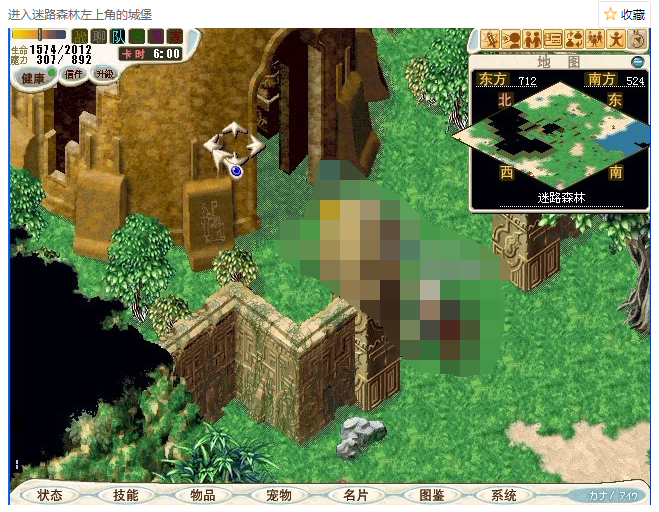
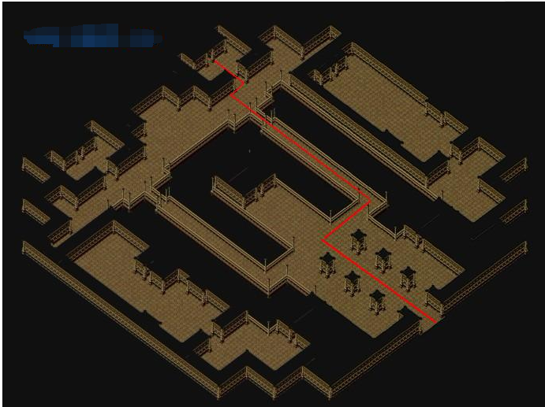
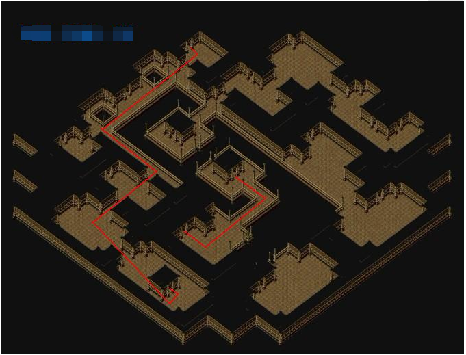
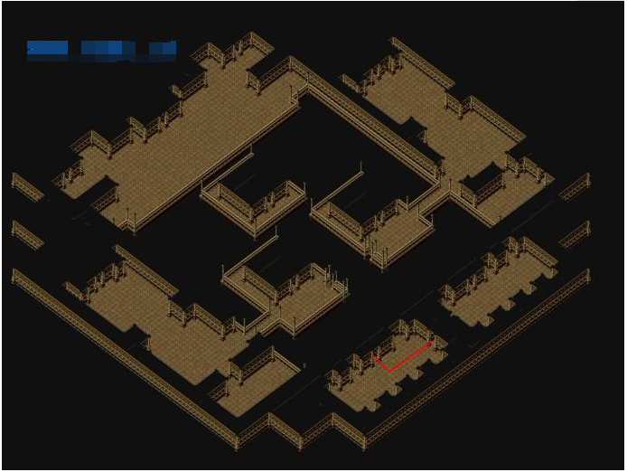
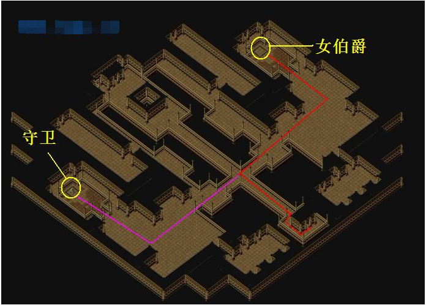

# 【童话王国3.0】爱丽丝梦游仙境

<mark style="color:red;">**任务提示**</mark>**：整个任务线，身上魔币千万别超过100W/人** &#x20;

\
\
\
【寻找爱丽丝】\
建议等级：无\
重复任务：不可\
BOSS：无\
奖励：5000魔币\
备注：\
任务流程：\
1.去找吉恩村的派翠西亚 ( 51,102 )，她叫你去找沉睡村的邓肯打听爱丽丝的消息。\
2.去沉睡村问邓肯（沉睡村55.42进屋），他说去问挖土虫夏鲁。\
3.去沉睡湖613 ：709找挖土虫夏鲁，他说爱丽丝跑到迷路森林去了...\
4.到迷路森林（沉睡湖585,675进入洞窟出去后）找度度鸟（707,619），它会要你去梦想花园找挖土虫康纳拿△梨果汁。\
5.到梦想花园找挖土虫康纳(723.660)，他叫你去找：100个果梨拿给他以後就可以取得△梨果汁。\
6.回去跟度度鸟说话并给得到5000魔币。  \
<mark style="color:red;">备注1：沉睡湖东边洞穴，怪物 白虎 黑熊115级</mark>\ <mark style="color:red;">备注2：梦想花园走法   沉睡湖东边洞窟 地下1楼→地下2楼58,9     地下2楼→地下1楼53,11     梦想花园入口（39,70）</mark>\ <mark style="color:red;">备注3：迷路森林走法   沉睡湖东边洞窟 地下1楼→地下2楼58,9     地下2楼→地下1楼12,17     迷路森林入口（51,16）</mark>\ <mark style="color:red;">备注4：梦想花园，迷路森林  120级怪</mark>\
\
\
\
【忙碌的迟到兔】\
建议等级：120级\
重复任务：不可\
BOSS：有\
奖励：5000魔币\
备注：需完成寻找爱丽丝\
任务流程：\
1\. 清晨+黄昏去迷路森林找迟到兔（697.581），他叫你去找他的小白手套。\
2\. 在迷路森林杀食人花 ( 随机在战斗中遇到 ) 打小白手套还给迟到兔，他会叫你回吉恩村告诉派翠西亚有关爱丽丝的下落。\
3\. 回吉恩村跟派翠西亚说话，她会给你5000魔币，任务结束。\
<mark style="color:red;">**备注1：食人花为120级BOSS战，全地图随机遇到，似蓝8山贼，?%掉落白手套\*1  每位队员都需1个**</mark>\
<mark style="color:red;">**备注2：白手套难刷,耗时较久,不可交易,建议带佣兵挂机刷**</mark>\
\
\
\
【疯狂女伯爵】\
建议等级：120级\
重复任务：不可\
BOSS：有\
奖励：无\
备注：需完成忙碌的迟到兔\
任务流程：\
1、跟吉恩村派翠西亚说话，得知扑克城堡里德女伯爵能救爱丽丝,得到给女伯爵的信。\
2、进入迷路森林右上角的城堡（712,521），在城堡内找到女伯爵（固定迷宫，见附1地图）\
3、见到女伯爵把事情前后说给她听后，她觉得这事很难办，但可以帮你弄到通行证，条件需经受其试炼\
4、击败女伯爵随机从其身上得到通行证一张（100%获取一张，可丢地，<mark style="color:red;">每人都需要一张</mark>）\
5、拿着通行证找到守卫后可进入城堡顶层花园。\
备注1：城堡内部125级 不死系怪物\
备注2：地图走法见下图\
\
\
\
【悲情的士兵】\
建议等级：120级\
重复任务：不可\
BOSS：有\
奖励：白宝石戒指\
备注：需完成疯狂女伯爵\
任务流程：\
1、通过城堡顶层花园进入皇宫，来到地下天牢\
2、到天牢里找到扑克牌士兵得知想探望爱丽丝需帮他打扫天牢\
3、在天牢里打败随机出现的怪物收集到垃圾A、B、C各5个\
4、把收集到的垃圾给士兵得到钥匙（全队只需1个钥匙）\
5、用钥匙打开牢门与牢里的爱丽丝对话\
6、爱丽丝要求你帮她跟女王求情，得到“爱丽丝向女王的认错信”\
7、来到王宫女王把你当成刺客，进入战斗（2连战女王有一定几率掉落<mark style="color:red;">**白宝石戒指**</mark>）\
8、得知是误会，因女王欣赏你武艺高强决定格外开恩释放爱丽丝\
\
\
\
【大逃亡】\
建议等级：120级\
重复任务：不可\
BOSS：有\
奖励：孔雀石项链、随机6-8级宠物装备\*1\
备注：需完成悲情的士兵\
任务流程：\
1、拿着女王给的特赦令前往天牢释放爱丽丝\
2、在天牢里发现爱丽丝神情痴呆\
3、通过对面牢房的囚犯（37,27）得知女王刚不求给爱丽丝下了毒药\
4、从囚犯那得知救爱丽丝的方法\
5、穿过囚犯后面的墙进入门之迷宫（迷宫大约30层）\
6、在迷宫底层遇见被囚禁的御医\
7、御医要你配其活动活动胫骨才能给你救爱丽丝的解药\
8、击败御医得到解药回去救爱丽丝\
9、救出爱丽丝后得到报平安的信，拿着信去找吉恩村的派翠西亚\
10、跟派翠西亚对话得到<mark style="color:red;">**孔雀石项链**</mark>任务完成，完成后可重复做本系列任务\
\
**附1 ：地图**\
    
