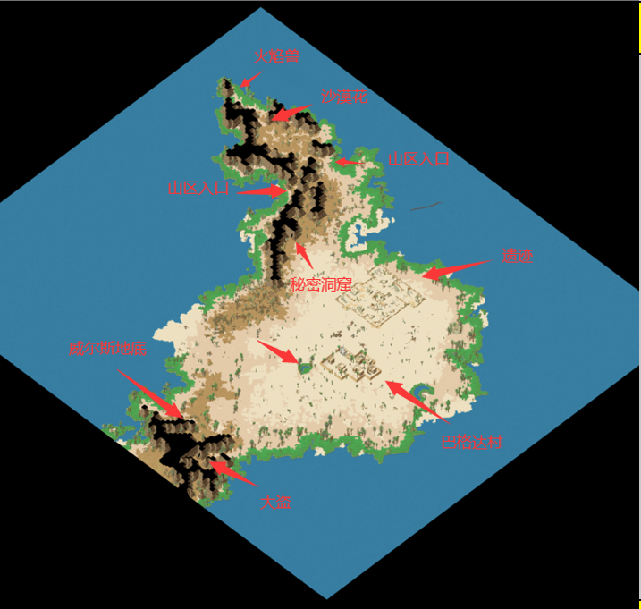

# 【童话王国4.0】一千零一夜

 \
\
\
\
**任務名稱: 阿里巴巴四十大盗**\
**限制:佩戴 "孔雀石项链"**\
**流程:**\
1、在巴格达医院找大夫哈玛;\
2、到医院左下方的民房找依那亚;\
3、再回來转告哈玛.哈玛卻突發奇想;\
4、到村外有绿洲池塘旁找巴利滋（以利暗沙漠534,329）;\
5、他會教你唱大盜之歌.好讓你混入大盜中;\
6、學會之後來到以利暗沙漠的左下腳，找看門的"大盗迪卡"（以利暗沙漠385,334）;\
7、他不相信你是新來的.要你證明自己的身份，唱大盜之歌給他聽;\
a.抢到都算我的;\
b.谁能跟我较量;\
c.所有宝藏归我享;\
\*以上只有一个是正确答案,选错会扣1000魔币并需重新开始任务！\*每个角色的答案都可能不同，如果A不对下次就选B或C。\
8、拿到失忆药回去找哈玛得到配药卡\
9、在村里找到呆呆的少年；发现其失去记忆，\
10、然后去医院找哈玛得到“强制记忆的药方\
11、根据药方所需材料分别到村外打怪仙人掌掉提神花、卡拉斯山区的三角龟掉角、BOSS沙漠之花掉还魂草、火鸠兽掉羽毛\*掉落道具均可交易\
12、拿着所需的材料回去找哈玛得到强制记忆糖\
13、给少年服下糖后得知其是"阿里巴巴"，并告诉你大盗的宝藏一事，对话结束获得"陈年高粱"酒\
14、回去找看門的"大盗迪卡"并把其灌醉进入大盗的洞穴;\
15、穿过洞穴进入大盗的营地,找到大盗藏宝的屋子并击败里面看守宝藏的四十大盗（5%掉落钥匙）\
16、得到钥匙的人可以用钥匙打开锁住的宝箱得到金项链\
17、没钥匙的人对着没锁的宝箱说句芝麻开门可以得到金戒指（任务结束）\
\
<mark style="color:red;">金项链（不可交易）|6级项链|150耐久|攻击魔力50\~200|回复魔抗魔攻10\~100|六抗性10\~20|四修正5\~10</mark>\ <mark style="color:red;">金戒指（不可交易）|6级戒指|150耐久|攻击防御敏捷精神5\~10|四修正5\~10</mark>\
\
<mark style="color:red;">**完成本任务额外获得以下宠物装备之一**</mark>\
银蛇指环|8级宠物首饰|耐久300|攻击28\~64|必杀1\~3|命中3\~6\
丝西娜指环|9级宠物首饰|耐久300|攻击36\~72|必杀1\~4|命中4\~8\
美杜莎指环|10级宠物首饰|耐久300|攻击40\~80|必杀1\~5|命中5\~10\
\
厄俄斯护符|8级宠物首饰|耐久300|敏捷16\~64|闪躲3\~6\
塞勒涅护符|9级宠物首饰|耐久300|敏捷36\~72|闪躲4\~8\
潘狄亚护符|10级宠物首饰|耐久300|敏捷40\~80|闪躲5\~10\
\
地狱武装|8级宠物铠甲|耐久300|防御84\~120|生命200\~300|魔抗32\~48\
哈迪斯之铠|9级宠物铠甲|耐久300|防御100\~132|生命300\~400|魔抗36\~54\
魔神铠|10级宠物铠甲|耐久300|防御120\~146|生命400\~500|魔抗40\~60\
\
\
\
**阿拉丁與小公主席拉**\
**限制：佩戴"金戒指"或者"金项链"**\
**流程:**\
1、在巴格达村的村长家看到小公主席拉。\
2、席拉委托你前往 威尔斯地底洞穴（秘密平原97,283）击杀迷之幻獸取回他的照片項鍊（迷之幻兽在洞穴中随机遇敌）\
3、將照片項鍊給她之後，她會告訴她喜歡阿拉丁，叫你去找阿拉丁問他的心意 \*必须佩戴金戒指或者金项链才可以进行\
4、來到巴格達村阿拉丁的家，他媽媽卻告訴你阿拉丁去秘密古墓探險\
5\. 找到以利暗沙漠 626.209的地方直接進入秘密古墓\
6\. 在秘密古墓找到随机出现的阿拉丁，得到钥匙\
7.来到最底层用钥匙打开古墓大门，进入密室捡起神灯\
8\. 遇到神灯點神燈精靈進入戰鬥，\
9\. 打完神燈精靈說完話之後，把坏的神灯拿去巴格達村的阿当修理，\
\*必须提前准备5000魔币 不然会任务中断\
10\. 將新神燈交給阿拉丁，回去把阿拉丁的心意轉告給小公主席拉知道得到"爱的祝福"，任務就到此結束囉 \~\
\
<mark style="color:red;">爱的祝福（不可交易）|6级护身符|150耐久|攻击10\~80|防御10\~80|敏捷10\~80|精神10\~80|回复10\~80</mark>\
\
<mark style="color:red;">**完成本任务额外获得以下宠物装备之一**</mark>\
死神双刃斧|8级宠物武器|耐久300|攻击100\~136|必杀1\~5|命中1\~5\
地狱战斧|9级宠物武器|耐久300|攻击120\~152|必杀3\~8|命中3\~8\
魔神斧|10级宠物武器|耐久300|攻击136\~160|必杀5\~10|命中5\~10\
\
魔剑|8级宠物武器|耐久300|攻击5\~30|精神80\~100|闪躲5\~10\
桑默斯法杖|9级宠物武器|耐久300|攻击5\~40|精神100\~130|闪躲10\~15\
波塞冬之智|10级宠物武器|耐久300|攻击5\~50|精神120\~160|闪躲15\~20\
\
恶魔法袍|8级宠物法袍|耐久300|防御28\~36|生命200\~300|魔力170\~220|魔抗32\~48\
哈迪斯长袍|9级宠物法袍|耐久300|防御32\~48|生命300\~400|魔力190\~260|魔抗36\~54\
天神袍|10级宠物法袍|耐久300|防御42\~52|生命400\~500|魔力220\~300|魔抗40\~60\
\
\
\
**辛巴達歷險**\
**限制：佩戴"爱的祝福"**\
**流程:**\
1\. 來到巴格达城遗迹，找到辛巴达，对话得到"手电筒"\
2\. 装备"手电筒" 在遗迹里随机遇敌 寻找冒牌的国王\
3\. 击败 冒牌的国王 50%几率得到"迷之玩偶"（不可交易）\
4\. 进入迷之地下室,穿过邪恶的黑暗空间来到空间底层\
5\. 与魔王戈尔歌对话 会进入Boss战，胜利后获得"国王娃娃"\
8\. 回去找辛巴达，得知卡拉斯山的魔女能解开咒语\
9\. 找到魔女（卡拉斯山区274,141）解开国王身上的咒语\
10.去村长家找村长领取奖励（随机得到火琵琶或水琵琶）\
\
\
<mark style="color:red;">火琵琶（不可交易）|1级乐器|150耐久|火属性20|攻击10\~100|命中1\~15|</mark>\ <mark style="color:red;">水琵琶（不可交易）|1级乐器|150耐久|水属性20|敏捷10\~100|闪躲1\~15|</mark>\
\
<mark style="color:red;">**完成本任务额外获得以下宠物装备之一**</mark>\
亡灵头饰|8级宠物头盔|耐久300|防御48\~62|魔抗26\~32|生命50\~100\
恶魔头盔|9级宠物头盔|耐久300|防御60\~66|魔抗30\~40|生命100\~150\
魔神头盔|10级宠物头盔|耐久300|防御66\~76|魔抗32\~56|生命150\~200\
\
青龙足具|8级宠物足具|耐久300|防御32|敏捷16\~32|魔抗26\~36\
魔龙足具|9级宠物足具|耐久300|防御36|敏捷18\~36|魔抗30\~40\
天龙足具|10级宠物足具|耐久300|防御40|敏捷20\~40|魔抗32\~56\
\
符文水晶极|8级宠物水晶|耐久300|攻击140\~160|精神70\~80|回复140\~160|生命魔力200\~300\
开天水晶|9级宠物水晶|耐久300|攻击160\~180|精神80\~90|回复160\~180|生命魔力300\~400\
动能水晶|10级宠物水晶|耐久300|攻击180\~200|精神90\~100|回复180\~200|生命魔力400\~500
