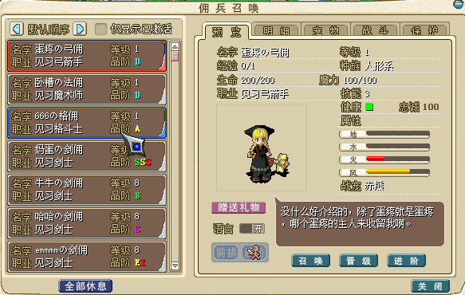
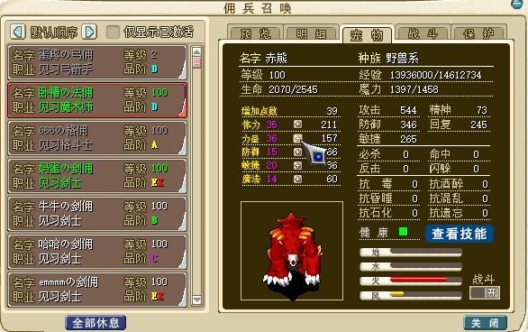
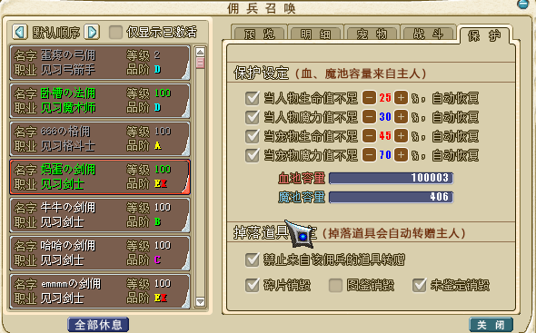
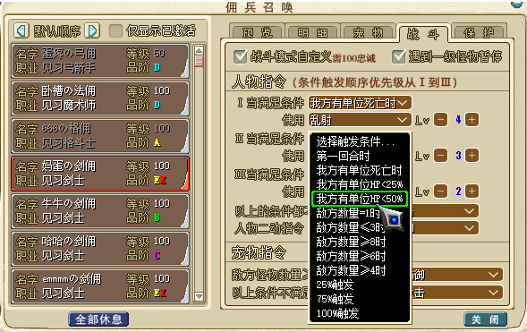

---
layout:
  title:
    visible: true
  description:
    visible: true
  tableOfContents:
    visible: true
  outline:
    visible: true
  pagination:
    visible: false
---

# ‼️ AI智能佣兵陪玩系统

\
<mark style="color:red;">**如何获得佣兵**</mark>\
完成新手任务后会获得4张《佣兵招募券》\
可以兑换的佣兵：弓手、格斗和传教（注意其中弓手和格斗最多携带3名，传教最多1名）其他佣兵可以通过游戏内获得\
\
\
<mark style="color:red;">**佣兵除了品阶和职阶之外如何增强实力**</mark>\
[《佣兵装备献祭》详情点击查看](yong-bing-zhuang-bei.md)\
\
\
<mark style="color:red;">**佣兵如何升级**</mark>携带一起战斗即可获得经验升级！\
<mark style="color:purple;">**佣兵战斗获得的经验会额外增加25%**</mark>，玩家打卡时选择全队打卡，会帮佣兵也打卡成功\
佣兵升级不用加点，会自动成长，佣兵成长值远高于玩家！\
\
<mark style="color:red;">**佣兵如何职业晋级**</mark>\
玩家在进行职业1转2转和3转时，所击杀的BOSS，都会有几率掉落佣兵晋级证明\
每个阶段都需要3张对应的晋级证明（道具商场有售）。集齐后可佣兵晋级\
\
**树精长老掉率100%**\
**神兽掉率100%**\
**双王掉率100%**\
\
\
<mark style="color:red;">**佣兵技能介绍说明**</mark>\
查看佣兵的技能假设为10级，实际最高使用等级关联 佣兵的职业阶级 和 佣兵的实际等级\
例如乱射10级，但是佣兵只是见习弓箭手，并且只有20级\
那么当前的乱射最高等级为 乱射Lv3\
佣兵的技能效果等同于人物的技能效果，请参考人物技能设定\
\
\
<mark style="color:red;">**佣兵宠物介绍说明**</mark>\
佣兵初始宠物<炎斗精灵>(气功弹4、阳炎4)\
佣兵职业1转宠物<水龙蜥> 技能（气功弹5、诸刃2、崩击2、战栗2）\
佣兵职业2转宠物<白螳螂> 技能（气功弹6、诸刃3、崩击3、战栗3、明镜3）\
佣兵职业3转宠物<斩龙之刃> 技能（气功弹7、诸刃4、崩击4、战栗4、明镜4、圣盾4）\
<mark style="color:purple;">注1：佣兵宠物无法更换，如发现中后期宠物乏力可以选择取消佣兵携带宠物</mark>\ <mark style="color:purple;">注2：佣兵宠物升级需要手动加点</mark>\ <mark style="color:purple;">注3：如果系统更新佣兵版本升级，需要给宠物重新加点</mark>\
\
\
<mark style="color:red;">**佣兵忠诚度说明（重要）**</mark>\
佣兵初始忠诚度 100 点\
佣兵升级增加忠诚度2点、进阶增加2点、晋级增加2点\
佣兵掉魂减少忠诚度10点、受伤减少1点\
佣兵出战需求 60 点\
佣兵自定义战斗模式需要 100 点\
<mark style="color:purple;">注1：佣兵礼物可以增加忠诚度，可在魔币精品商店/道具商场购买，或者击杀海神几率获得</mark>\ <mark style="color:purple;">注2：佣兵忠诚度不满时,战斗结束后有几率会将其获得的物品不赠送给玩家</mark>\ <mark style="color:purple;">注3：佣兵忠诚度不满时,战斗时有几率会什么都不做</mark>\
\
\
<mark style="color:red;">**佣兵回复血蓝/治疗/招魂**</mark>\
玩家回到勇者大厅后 佣兵会自动补满血蓝并治疗和招魂（无需费用）\
在其他地方战斗可以选择和玩家共用一个血魔池回复HP/MP\
同时可以对其使用料理和血瓶\
<mark style="color:purple;">**佣兵状态回复点<勇者大厅> <圣拉鲁卡村><伊尔村><亚留特村><加纳村><维诺亚村>**</mark>\
\
\
<mark style="color:red;">**佣兵进阶 和 属性成长 和 佣兵宠物成长**</mark>\
&#x20;   佣兵基础属性成长为固定值（无法手动加点），只能通过进阶提升\
&#x20;   佣兵宠物可以在升级后进行手动加点\
&#x20;   佣兵初始品阶为D 最高品阶为EX\
&#x20;   <mark style="color:purple;">**D >> S每阶段提升10%属性,S >> EX每阶段提升20%属性 最高可达220%属性**</mark>\
&#x20;   可以通过对应的佣兵卷进行升级（前9阶需要5张佣兵卷晋级 EX需要10张）\
\
\
<mark style="color:red;">**佣兵战斗模式自定义**</mark> [<mark style="color:red;">**<详情介绍点击查看>**</mark>](http://www.douyaml.com/forum.php?mod=viewthread\&tid=344)\
\
\
<mark style="color:red;">**佣兵道具转增规则**</mark>\
可以选择禁止转增/碎片销毁/图鉴销毁/未鉴定销毁\
战斗结束和开启宝箱 等等 佣兵都可以和玩家一样获取道具\
获取道具后 玩家头顶会出现**邮件标志** ，点击后，可以选择领取或舍弃该道具\
部分道具无法通过佣兵转增\
无法转增列表：勾玉的碎片\
<mark style="color:purple;">注1：佣兵默认背包空间为40格</mark>\ <mark style="color:purple;">注2：佣兵忠诚度不满时有几率会不赠送给玩家道具</mark>\
\
\
\
\
<mark style="color:red;">**以下图片仅供参考：**</mark>\
\
\
\
\
\
\
