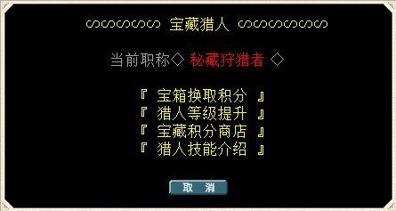

---
layout:
  title:
    visible: true
  description:
    visible: true
  tableOfContents:
    visible: true
  outline:
    visible: true
  pagination:
    visible: false
---

# ‼️ 宝藏猎人系统

<table data-header-hidden><thead><tr><th width="155" align="center"></th><th></th></tr></thead><tbody><tr><td align="center"></td><td></td></tr><tr><td align="center"><strong>简  介</strong></td><td></td></tr><tr><td align="center"><mark style="color:green;"><strong>加入宝藏猎人</strong></mark></td><td>玩家出生默认为见习宝藏猎人</td></tr><tr><td align="center"><mark style="color:green;"><strong>宝藏积分</strong></mark></td><td>通过掠夺技能从迷宫内获得宝箱带回换取积分</td></tr><tr><td align="center"><mark style="color:green;"><strong>宝藏猎人职称</strong></mark></td><td>见习宝藏猎人、正式宝藏猎人、资深宝藏猎人 传奇宝藏猎人、秘藏狩猎者</td></tr><tr><td align="center"><mark style="color:purple;"><strong>被动技能1</strong></mark> <mark style="color:purple;"><strong>掠夺</strong></mark></td><td><strong>-------------------------------</strong> <mark style="color:purple;">无需宝箱钥匙，右键点击迷宫宝箱时触发&#x3C;掠夺>被动技能</mark> 掠夺：耗魔 8 MP （35%几率捡起迷宫宝箱） <mark style="color:red;">捡起宝箱后可以丢地后使用钥匙再次打开，或者交给秘藏狩猎者NPC换取宝藏积分</mark> <strong>-------------------------------</strong></td></tr><tr><td align="center"><mark style="color:purple;"><strong>被动技能2</strong></mark> <mark style="color:purple;"><strong>探宝</strong></mark></td><td><strong>-------------------------------</strong> <mark style="color:red;"><strong>技能等级：</strong></mark> 探宝Lv1、探宝Lv2、探宝Lv3、探宝Lv4、探宝MAX （无耗魔）  <strong>用钥匙开宝箱时触发（</strong><mark style="color:red;"><strong>注意 必须是组队状态下队长开启才会生效</strong></mark><strong>）：</strong> 普通宝箱触发进入秘藏空间几率：5%、8%、10%、12%、15% 黑白宝箱触发进入秘藏空间几率：10%、15%、20%、25%、30% <strong>-------------------------------</strong></td></tr><tr><td align="center"><mark style="color:purple;"><strong>被动技能3</strong></mark> <mark style="color:purple;"><strong>寻觅</strong></mark> <mark style="color:purple;"><strong>（正式宝藏猎人及以上等级习得）</strong></mark></td><td><strong>-------------------------------</strong> <strong>技能等级：</strong>正式宝藏猎人可自动习得寻觅Lv1 寻觅Lv1、寻觅Lv2、寻觅Lv3、寻觅MAX（无耗魔） <strong>技能说明（抓日常宠物效率极高）：</strong> <strong>遇敌时有几率寻觅到对应的1级宠物  （部分宠物生效/列表在本帖最下方更新）</strong> <strong>正式宝藏猎人3%几率遇敌对应1级宠物（提升猎人阶级会提升几率,最高10%）</strong>  <mark style="color:orange;"><strong>示例：</strong>遇到10个18~20级的水龙蜥,这10个水龙蜥每个都有5%几率触发被动变为1级水龙蜥</mark> <mark style="color:orange;"><strong>注意：</strong>括号内为生效等级（不包括迷宫）,几率为每个怪物的几率（跟正常1级宠物遇敌率不重叠）</mark> <mark style="color:red;"><strong>可触发被动技能&#x3C;寻觅>的宠物</strong>（可以通过Ctrl+F 快速查询检索本页面宠物名称）</mark> 水龙蜥(18-20)、穴熊（16-18）、大地鼠（4-6）僵尸（27-30）、黄蜂（6-8）、螳螂（16-18）树精（5-7）、致命螳螂（18-20）、凶暴仙人掌（50-52）液态史莱姆（11-13）、烈风哥布林（30-40）、红帽哥布林（3-4）火焰鼠（15-17） <strong>-------------------------------</strong></td></tr><tr><td align="center"><strong>提升职称等级</strong></td><td>通过宝藏积分提升</td></tr><tr><td align="center"><strong>提升被动技能等级</strong></td><td>提升职称后 被动技能等级随之提升</td></tr><tr><td align="center"><strong>宝藏积分商店</strong></td><td>-------------- 宝箱怪图鉴套 200积分 阴影孵化器 900积分(改造宝箱获得随机影子) --------------</td></tr><tr><td align="center"><mark style="color:red;"><strong>秘藏空间</strong></mark> <mark style="color:red;"><strong>介绍</strong></mark></td><td><mark style="color:red;">（通过宝藏猎人被动技能 寻宝进入）</mark></td></tr><tr><td align="center"><mark style="color:red;"><strong>宝藏介绍</strong></mark></td><td>随机刷新10个秘藏宝箱</td></tr><tr><td align="center"><mark style="color:red;"><strong>宝藏规则</strong></mark></td><td> 进入秘藏空间后 <mark style="color:purple;">与秘藏守护者对话选择&#x3C;确认>可以直接返回原地</mark> 未开启的宝箱不会消失，静待下一位秘藏开启者...  </td></tr><tr><td align="center"><mark style="color:red;"><strong>秘藏内容介绍</strong></mark></td><td>
 <mark style="color:red;"><strong>秘藏空间内的宝箱可随机获得以下物品：</strong></mark> <strong>900魔石、2000魔石、5000魔石、形象券*1、洗档券*1、宠物乐园许可证*1</strong>   双击宠物乐园许可证飞到宠物乐园,每次遇敌消耗一张许可证

<strong>乐园宠物列表</strong><mark style="color:red;">（遇敌全部为1级宠物）</mark> <mark style="color:purple;">猫人系列、熊系列、鼠系列、地狱犬系列、僵尸系列、骷髅系列、幽灵系列</mark> <mark style="color:purple;">使魔系列、恶魔系列、小蝙蝠系列、大蝙蝠系列、蝎子系列、黄蜂系列、螳螂系列</mark> <mark style="color:purple;">蜘蛛系列、树精系列、妖草系列、口臭鬼系列、仙人掌系列、史莱姆系列</mark> <mark style="color:purple;">炸弹系列、龙蜥系列、螃蟹系列、蜥蜴系列、哥布林系列、盗贼系列</mark> <mark style="color:purple;">鸟人系列、血刃系列、翼龙系列、托罗帝鸟系列、稀有宠物系列</mark> <mark style="color:purple;">稀有宠物包括 四精、熊猫、鼠王、丘比特、丸子炸弹 （几率极低）</mark>
</td></tr><tr><td align="center"></td><td></td></tr></tbody></table>
