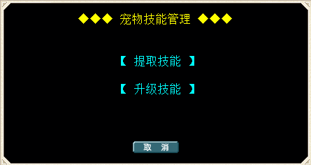

---
layout:
  title:
    visible: true
  description:
    visible: true
  tableOfContents:
    visible: true
  outline:
    visible: true
  pagination:
    visible: false
---

# 宠物技能提取/升级

<table data-header-hidden><thead><tr><th width="192" align="center"></th><th></th></tr></thead><tbody><tr><td align="center"> </td><td></td></tr><tr><td align="center"><strong>简  介</strong></td><td></td></tr><tr><td align="center"><strong>技能提取</strong></td><td>宠物气功弹、超强魔法等技能可提取为"宠物技能卷轴"</td></tr><tr><td align="center">操作步骤</td><td>将需要提取技能的宠物放置宠物栏第一格 选择"提取技能"项  扣除一定量的"魔币"后 提取成功 注：部分宠物技能无法提取 请关注各宠物介绍</td></tr><tr><td align="center"> </td><td> </td></tr><tr><td align="center"><strong>技能卷轴升级</strong></td><td>宠物气功弹、超强魔法等技能卷轴 可升级更高的技能卷轴</td></tr><tr><td align="center">操作步骤</td><td>将需要升级的"宠物技能卷轴"放置在物品栏第一格 选择"升级技能"项  根据技能卷轴等级不同 扣除"魔币""后 升级成功 最高宠物技能卷轴等级为Lv7</td></tr></tbody></table>
