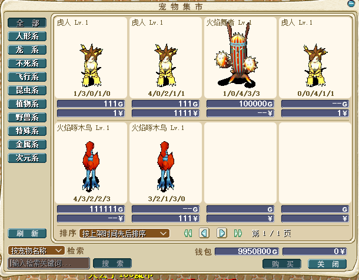

---
layout:
  title:
    visible: true
  description:
    visible: true
  tableOfContents:
    visible: true
  outline:
    visible: true
  pagination:
    visible: false
---

# 宠物市场/宠物集市

[<mark style="color:red;">**>宠物寄售功能点击查看<**</mark>](chong-wu-zi-shou-xi-tong.md)\
\
\
<mark style="color:red;">**点击游戏内的"功能面板">>"宠物集市" 即可打开查询**</mark>\
\
\
\
\
\
<mark style="color:red;">**点击"购买"或者"双击宠物"，即可弹出宠物详细信息**</mark>\
\
\
<mark style="color:red;">**可以根据宠物的售卖情况  选择"金币购买"或"商场币购买"**</mark>\
<mark style="color:red;">**注意！！购买成功后，宠物会直接到玩家所在的位置，要自己捡起来**</mark>\
\
\
[<mark style="color:red;">**>宠物寄售功能点击查看<**</mark>](chong-wu-zi-shou-xi-tong.md)
