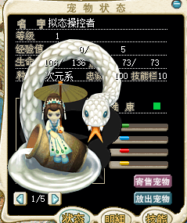
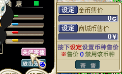
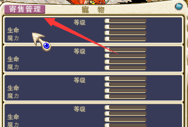
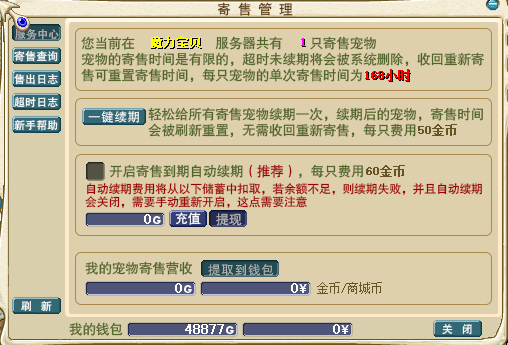
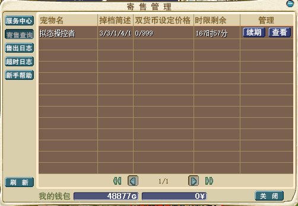

---
layout:
  title:
    visible: true
  description:
    visible: true
  tableOfContents:
    visible: true
  outline:
    visible: true
  pagination:
    visible: false
---

# 宠物自售系统

<table data-header-hidden><thead><tr><th width="58" align="center"></th><th></th></tr></thead><tbody><tr><td align="center"></td><td></td></tr><tr><td align="center"> </td><td><strong>1、打开宠物界面，点击"寄售宠物"</strong>     <strong>2、点击设定，选择需要出售的价格，可以同时设置商场币和魔币两种价格，设定价格后点击寄售即可开启"宠物离线自售"</strong>     <mark style="color:red;"><strong>3、打开宠物背包，点击左上角"寄售管理"可以对已寄售的宠物进行查看操作</strong></mark>     <mark style="color:red;"><strong>4、自动续费、提取货币、售出日志、在售列表等信息一应俱全</strong></mark>   </td></tr></tbody></table>
