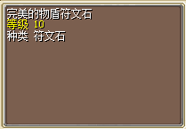

---
layout:
  title:
    visible: true
  description:
    visible: true
  tableOfContents:
    visible: true
  outline:
    visible: true
  pagination:
    visible: false
---

# 符文系统

\
\
<mark style="color:green;">**注意！！！附加符文的装备无法继续强化，必须清除符文后才可以继续强化装备**</mark>\
\
<mark style="color:red;">**符文石获得途径：**</mark>商城鼠王蛋抽奖、每周副本 等\
\
<mark style="color:red;">**符文石鉴定：**</mark>双击后自动鉴定品质\
\
<mark style="color:red;">**符文石使用：**</mark>需要附加符文的装备放在背包第一栏，双击符文石后附加属性 \[ 需要对应词缀 ]\
\
<mark style="color:red;">**符文石清除：**</mark>附加的属性需要清除，找NPC花费5000魔币\
\
<mark style="color:red;">**符文石重置：**</mark>如果鉴定后的符文石词缀或者品质不满意，可用三个合成新的符文石\*1 \[ 分别放置背包第1、2、3格后跟NPC对话合成新的符文石 ]\
\
<mark style="color:red;">**符文石品质：**</mark>『普通』、『优良』、『完美』\
\
\
<mark style="color:green;">**获得符文石后，双击获得类似道具 “完美”代表品质 “物盾”代表词缀 同时代表可以镶嵌的部位**</mark>\
<mark style="color:green;">**可以查询下面词缀主属性，物盾=镶嵌脚部装备**</mark>\
<mark style="color:green;">**镶嵌后，完美级的符文 除主属性外，还会额外附加4条随机属性（最下方查询）**</mark>\
\
\===========\
<mark style="color:orange;">**注意！附加符文的装备无法继续强化，必须清除符文后才可以继续强化装备**</mark>\
\
\===========\
\
\
&#x20;  <mark style="color:purple;">**武器   符文词缀主属性：**</mark>\
&#x20;     杀戮   所有伤害+ 3%\
&#x20;     凶兽   宠物魔法伤害+ 6%\
&#x20;     幽冥   所有咒术成功率+ 3%\
&#x20;     锋殇   装备剑时伤害+ 4%\
&#x20;     狂殇   装备枪时伤害+ 4%\
&#x20;     悍殇   装备斧时伤害+ 4%\
&#x20;     隼殇   装备弓时伤害+ 4%\
&#x20;     疾殇   装备回力时伤害+ 4%\
&#x20;     影殇   装备小刀时伤害+ 4%\
&#x20;     灵殇   装备仗时伤害+ 4%\
&#x20;     疗心   治疗类技能效果+ 4%\
\
\
&#x20;  <mark style="color:purple;">**身体   符文词缀主属性：**</mark>\
&#x20;     坚韧   HP+100\
&#x20;     活泉   MP+100\
&#x20;     强健   防御+30\
&#x20;     灵巧   敏捷+30\
&#x20;     活力   回复+30\
&#x20;     睿智   精神+30\
\
\
&#x20;  <mark style="color:purple;">**头部   符文词缀主属性:**</mark>\
&#x20;     毒护   中毒抗性+15\
&#x20;     睡护   昏睡抗性+15\
&#x20;     石护   石化抗性+15\
&#x20;     醉护   酒醉抗性+15\
&#x20;     乱护   混乱抗性+15\
&#x20;     忘护   遗忘抗性+15\
\
\
&#x20;  <mark style="color:purple;">**脚部   符文词缀主属性:**</mark>\
&#x20;     怒破   必杀+4\
&#x20;     幻鹰   命中+4\
&#x20;     极速   闪避+4\
&#x20;     尾返   反击+4\
&#x20;     凝身   获得经验+12%\
&#x20;     铁壁   受到所有伤害-3%\
&#x20;     物盾   受到的物理伤害-4%\
&#x20;     灵盾   受到的魔法伤害-4%\
&#x20;     灵兽   宠物受到的伤害-6%\
\
\
<mark style="color:red;">**附加属性：**</mark>\
&#x20;      **除了主属性外，还会根据符文品质额外附加属性（属性可重复出现）**\
\
&#x20;     『<mark style="color:purple;">**普通**</mark>』额外附加以下任意2条附加属性\
&#x20;     『<mark style="color:orange;">**优良**</mark>』额外附加以下任意3条附加属性\
&#x20;     『<mark style="color:red;">**完美**</mark>』额外附加以下任意4条附加属性\
\
&#x20;     HP+ 10\~100\
&#x20;     MP+ 10\~100\
&#x20;     攻击+ 10\~30\
&#x20;     防御+ 10\~30\
&#x20;     敏捷+ 10\~30\
&#x20;     回复+ 10\~30\
&#x20;     精神+ 10\~30\
&#x20;     必杀+ 1\~3\
&#x20;     命中+ 1\~3\
&#x20;     闪避+ 1\~3\
&#x20;     反击+ 1\~3\
\
&#x20;     所有伤害+ 1%\~2%\
&#x20;     中毒抗性+ 2\~5\
&#x20;     昏睡抗性+ 2\~5\
&#x20;     石化抗性+ 2\~5\
&#x20;     酒醉抗性+ 2\~5\
&#x20;     混乱抗性+ 2\~5\
&#x20;     遗忘抗性+ 2\~5\
&#x20;     治疗类技能效果+ 1%\~3%\
&#x20;     物理伤害+ 1%\~3%\
&#x20;     魔法伤害+ 1%\~3%\
&#x20;     受到魔法伤害减少 1%\~3%\
&#x20;     宠物所有伤害+ 1%\~3%\
&#x20;     宠物受到所有伤害减少 + 1%\~3%\
&#x20;     宠物物理伤害+ 2%\~4%\
&#x20;     宠物受到物理伤害减少 + 2%\~4%\
&#x20;     宠物魔法伤害+ 2%\~4%\
&#x20;     宠物受到魔法伤害减少 + 2%\~4%\
&#x20;     获得经验+ 3%\~6%\
\
\
<mark style="color:green;">**注意！附加符文的装备无法继续强化，必须清除符文后才可以继续强化装备**</mark>
