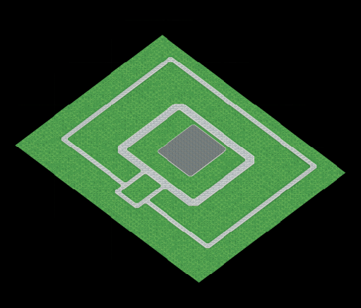
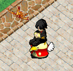
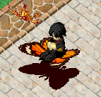
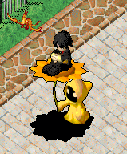
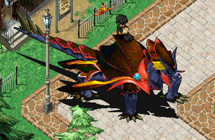
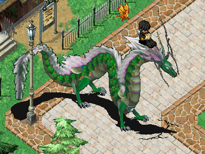

---
layout:
  title:
    visible: true
  description:
    visible: true
  tableOfContents:
    visible: true
  outline:
    visible: true
  pagination:
    visible: false
---

# ❗ 家族系统(家族副本)

<mark style="color:purple;">**创建家族要求**</mark>\
&#x20;   商城点200\
\
<mark style="color:purple;">**家族可容纳人数**</mark>\
&#x20;   1级家族可容纳成员20人（20/40/60/80/100/120/140/160/200 最高200人）\
&#x20;   家族最高9级\
&#x20;   学院最高10级\
\
<mark style="color:purple;">**家族称号（关联家族权限）**</mark>\
&#x20;   家族可设定1-8个称号**（等于1-8级家族权限）**\
&#x20;   新入成员默认为第8个称号\
&#x20;   家族长可对称号名称自定义（最多5个字）\
&#x20;   可自定义家族驻地装饰权限\
&#x20;   可自定义家族仓库使用权限（未开放）\
\
<mark style="color:purple;">**家族装饰功能：**</mark><mark style="color:red;">**New**</mark>\
&#x20;   在家族驻地-装饰商店内可以购买 装饰采集道具 / 装饰拆除道具\
&#x20;   **装饰采集道具**：可在任意场景采集物件图像后，装饰到家族驻地内\
&#x20;  **装饰拆除道具**：可在家族驻地内拆除位置不合适的装饰物到背包内,每次消耗1耐久\
\
<mark style="color:purple;">**家族驻地：**</mark><mark style="color:red;">**New**</mark>\
&#x20;   每个家族拥有的独立空间，可以自由装饰，每次升级家族，主建筑会自动升级\
&#x20;   **驻地功能**：家族升级/学院升级/家族副本/装饰商店/捐献物资/族长权限管理/家族仓库(暂未开放)\
\
<mark style="color:purple;">**家族经验：**</mark>\
&#x20;   在家族驻地内通过 家族副本/捐献魔币/捐献商场币增加\
\
<mark style="color:purple;">**家族物资：**</mark>\
&#x20;   在家族驻地内通过 家族副本击杀怪物获得 【物资箱】后捐献给家族获得\
\
<mark style="color:purple;">**战争学院（经验BUFF）**</mark>\
&#x20;   可在家族驻地用"家族物资"升级战争学院等级（战争学院等级关联经验BUFF等级）\
&#x20;   1级**"经验BUFF"**可增加5%战斗经验（每升1级增加5%,最高50%）\
&#x20;   <mark style="color:orange;">**该效果对玩家和宠物均有效**</mark>\
\
<mark style="color:purple;">**科技学院（技能BUFF）**</mark>\
&#x20;   可在家族驻地用"家族物资"升级科技学院等级（科技学院等级关联技能BUFF等级）\
&#x20;   1级**"技能BUFF"**可增加10%技能经验（每升1级增加10%,最高100%）\
&#x20;   <mark style="color:orange;">**该效果对战斗/采集/制造/服务技能均有效**</mark>\
\
<mark style="color:purple;">**疾风学院（迅捷BUFF）**</mark>\
&#x20;   可在家族驻地用"家族物资"升级疾风学院等级（疾风学院等级关联技能BUFF等级）\
&#x20;   1级**"迅捷BUFF"**可增加10%坐骑移动速度（每升1级增加2%,最高增加30%）\
&#x20;   <mark style="color:orange;">**该效果对节日坐骑无效**</mark>\
\
<mark style="color:purple;">**家族副本（竞争类副本 所有家族均进入同一副本地图）**</mark>**  **<mark style="color:red;">**New**</mark>\
&#x20;   **开启时间：见论坛每日活动公告**\
&#x20;   **副本地点：**系统开启后,由家族驻地 "家族管家" 进入\
&#x20;   **玩法介绍：**\
&#x20;   ①所有家族的成员均可进入（其他家族也可进入）\
&#x20;   ②家族成员击杀BOSS 获得相应的贡献点和家族物资\
&#x20;   ③家族副本第一阶段为80级和100级 BOSS组合\
&#x20;   ④击杀BOSS获得<魂晶>道具\
&#x20;   ⑤家族副本第一阶段地图内找寻 <祭坛>并上交一定数量<魂晶>即可开启第二阶段地图（所有玩家上交魂晶 累计计数）\
&#x20;   ⑥副本第二阶段为120级和140级BOSS，并包含特有160级BOSS各1\
&#x20;   ⑦BOSS等级越高获得的家族贡献和家族物资越高\
&#x20;   ⑧所有BOSS均掉落10万\~500万人物经验药剂\
&#x20;   ⑨140级BOSS10%掉落 "伪·世界之理" /160级BOSS(50%掉落 "真·世界之理"/50%几率掉落 "伪·世界之理")[>世界之石资料点击查看<](http://www.douyaml.com/forum.php?mod=viewthread\&tid=356)\
\
&#x20;   注1：家族副本限时90分钟,副本结束后就算还在战斗中,胜利也不会获得奖励\
&#x20;   注2：家族副本BOSS击杀后不会再次刷新，同一BOSS多个玩家触发时，首先击杀者获得奖励\
&#x20;   注3：特定BOSS会掉落稀有道具（测试阶段 暂未开放）\
&#x20;   注4：家族副本所有BOSS均有增强，测试阶段调整中...\
&#x20;   注5：击杀BOSS奖励，只有队长可以获得。\
\
<mark style="color:purple;">**家族贡献商店**</mark>**（**<mark style="color:red;">坐骑形象展示在本页下方</mark>**）**\
&#x20;   宠物随机修正/高级悬赏令/\
&#x20;   大公鸡坐骑形象/蝶恋花坐骑形象/向日葵坐骑形象/青龙坐骑形象/玄武坐骑形象\
\
\
<mark style="color:purple;">**家族仓库（暂未开放）**</mark>\
<mark style="color:red;">**注1：家族技能仅可生效1个，由家族族长选择和变更**</mark>\
<mark style="color:red;">**注2：家族仓库 暂未开放,敬请期待**</mark>\
**..**\
\
**家族驻地简略图**\
\
\
<mark style="color:red;">**========坐骑形象=============**</mark>\
  \
\
 
