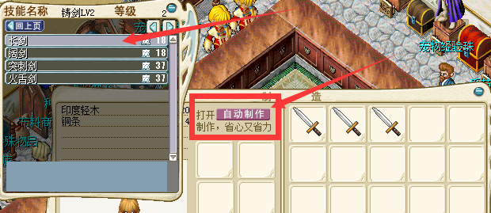

---
layout:
  title:
    visible: true
  description:
    visible: true
  tableOfContents:
    visible: true
  outline:
    visible: true
  pagination:
    visible: false
---

# ❗ UI版自动制作(自动制造)

<mark style="color:red;">"自动制作补充"道具使用后可增加100次自动制作次数</mark>\
\ <mark style="color:red;">价值8000魔币/可在勇者大厅商店区精品商店内购买</mark>\
\
\
<mark style="color:purple;">点击</mark><mark style="color:purple;">**<相关技能>**</mark><mark style="color:purple;">打开制作页面即可看到</mark><mark style="color:purple;">**<自动制作>**</mark><mark style="color:purple;">按钮</mark>\
\
\
自动制作消耗MP = 手动制作MP\
\
自动制作技能经验 = 手动制作经验的100%\
\
自动制作支持打卡
