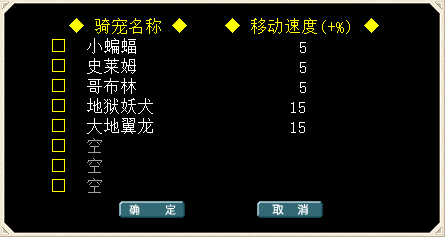

---
layout:
  title:
    visible: true
  description:
    visible: true
  tableOfContents:
    visible: true
  outline:
    visible: true
  pagination:
    visible: false
---

# 虚拟骑宠

<table data-header-hidden><thead><tr><th width="128" align="center"></th><th></th></tr></thead><tbody><tr><td align="center"></td><td></td></tr><tr><td align="center"><strong>简           介</strong></td><td></td></tr><tr><td align="center"><strong>坐骑属性</strong></td><td><mark style="color:red;">无附加属性，只增加移动速度，如队长使用，全队速度都会增加</mark> <mark style="color:red;">最高移速120%上限</mark></td></tr><tr><td align="center"><strong>获得方法</strong></td><td><mark style="color:orange;">做完国民任务即可获得1个初始虚拟骑宠（参照新手攻略）</mark> <mark style="color:orange;">进阶虚拟骑宠可以通游戏内或商城获得</mark> <a href="../you-xi-zhi-nan/xu-ni-qi-chong-xiang-guan.md"><mark style="color:orange;">详情查看</mark></a> </td></tr><tr><td align="center"><strong>使用方法</strong></td><td>获得虚拟骑宠道具后，双击后 选择一个任意栏位插入 然后点击窗口右侧的便捷按钮&#x3C;虚拟骑宠> 即可打开角色骑宠列表,选择即可 如需取消骑乘打开虚拟骑宠后点击&#x3C;取消>即可</td></tr><tr><td align="center"><strong>注意事项</strong></td><td>道具时可交易，登记后会绑定角色无法交易</td></tr></tbody></table>
