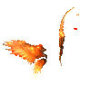
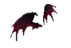
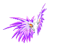
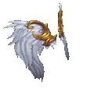

---
layout:
  title:
    visible: true
  description:
    visible: true
  tableOfContents:
    visible: true
  outline:
    visible: true
  pagination:
    visible: false
---

# 羽翼系统

<table data-header-hidden><thead><tr><th width="162" align="center"></th><th></th></tr></thead><tbody><tr><td align="center"> </td><td></td></tr><tr><td align="center"><mark style="color:green;"><strong>简           介</strong></mark></td><td> </td></tr><tr><td align="center"><mark style="color:green;"><strong>翅膀使用模式</strong></mark></td><td>每种最高9级，可使用额外翅膀形象</td></tr><tr><td align="center"><mark style="color:red;"><strong>烈焰之翼</strong></mark></td><td> <mark style="color:red;"><strong>主要属性：</strong></mark>物理增伤（满级25%） <mark style="color:red;"><strong>合成公式：</strong></mark> 翼之元素『风』+『火』+『光』+『烈焰』+ 羽翼经验珠1星（满）    </td></tr><tr><td align="center"><mark style="color:red;"><strong>魔龙之翼</strong></mark></td><td> <mark style="color:red;"><strong>主要属性：</strong></mark>魔法增伤 （满级25%） <mark style="color:red;"><strong>合成公式：</strong></mark> 翼之元素『地』+『水』+『暗』+『深渊』+ 羽翼经验珠1星（满）   </td></tr><tr><td align="center"><mark style="color:red;"><strong>精灵之翼</strong></mark></td><td> <mark style="color:red;"><strong>主要属性：</strong></mark>耗魔减少 / 生命增加（满级30% 生命+1000） <mark style="color:red;"><strong>合成公式：</strong></mark> 翼之元素『风』+『地』+『光』+『风暴』+ 羽翼经验珠1星（满）    </td></tr><tr><td align="center"><mark style="color:red;"><strong>灵魂之翼</strong></mark></td><td> <mark style="color:red;"><strong>主要属性：</strong></mark>魔法减伤 / 生命增加 （满级30% 生命+1000） <mark style="color:red;"><strong>合成公式：</strong></mark> 翼之元素『水』+『火』+『暗』+『寒冰』+ 羽翼经验珠1星（满）    </td></tr><tr><td align="center"><strong>幻神之翼</strong></td><td> <mark style="color:red;"><strong>主要属性：</strong></mark>致死免除 / 生命增加 （满级35% 生命+1000） <mark style="color:red;"><strong>合成公式：</strong></mark> 翼之元素『光』+『暗』+『寒冰』+『烈焰』+ 羽翼经验珠1星（满）   </td></tr><tr><td align="center"><strong>天使之翼</strong></td><td> <mark style="color:red;"><strong>主要属性：</strong></mark>物理减伤 / 生命增加 （满级30% 生命+1000） <mark style="color:red;"><strong>合成公式：</strong></mark> 翼之元素『地』+『水』+『火』+『风』+ 羽翼经验珠1星（满）   </td></tr><tr><td align="center"><mark style="color:purple;"><strong>翼之元素『地』</strong></mark></td><td><mark style="color:purple;">土之斗神 100%获得</mark></td></tr><tr><td align="center"><mark style="color:purple;"><strong>翼之元素『水』</strong></mark></td><td><mark style="color:purple;">水之斗神 100%获得</mark></td></tr><tr><td align="center"><mark style="color:purple;"><strong>翼之元素『火』</strong></mark></td><td><mark style="color:purple;">炎之斗神 100%获得</mark></td></tr><tr><td align="center"><mark style="color:purple;"><strong>翼之元素『风』</strong></mark></td><td><mark style="color:purple;">风之斗神 100%获得</mark></td></tr><tr><td align="center"><mark style="color:purple;"><strong>翼之元素『光』</strong></mark></td><td><mark style="color:purple;">热砂的欧兹尼克 100%获得（需队长佩戴熊男戒指，遇到逃跑组的热砂没有掉落几率）</mark></td></tr><tr><td align="center"><mark style="color:purple;"><strong>翼之元素『暗』</strong></mark></td><td><mark style="color:purple;">牛鬼讨伐 100%获得</mark></td></tr><tr><td align="center"><mark style="color:purple;"><strong>翼之元素『烈焰』</strong></mark></td><td><mark style="color:purple;">沙尘之洞  100%获得（无需士兵）</mark> <mark style="color:red;">队长携带鳗鱼饭团*3，索奇亚622,362进入沙尘之洞，迷宫内寻找NPC兑换三棱镜，最后击杀旋律影子</mark></td></tr><tr><td align="center"><mark style="color:purple;"><strong>翼之元素『风暴』</strong></mark></td><td><mark style="color:purple;">法尔肯 100%获得</mark></td></tr><tr><td align="center"><mark style="color:purple;"><strong>翼之元素『深渊』</strong></mark></td><td><mark style="color:purple;">黑暗医生 100%获得  UD 30%获得（《诱拐事件》《魔族改造计划》两个任务中的暗医均有掉率）</mark></td></tr><tr><td align="center"><mark style="color:purple;"><strong>翼之元素『寒冰』</strong></mark></td><td><mark style="color:purple;">佛利波罗 100%获得</mark></td></tr><tr><td align="center"> </td><td> </td></tr></tbody></table>

\
\
\
&#x20;                                      <mark style="color:red;">**羽翼1-9级为固定统一形象如需更羽翼形象，可以找羽翼系统NPC  购买各种羽翼形象**</mark>

<table data-header-hidden><thead><tr><th width="165" align="center"></th><th></th></tr></thead><tbody><tr><td align="center"> </td><td>                                                           <strong>羽翼经验珠</strong>                                               <mark style="color:red;">（一键清理背包垃圾道具）</mark></td></tr><tr><td align="center"> </td><td> </td></tr><tr><td align="center"><mark style="color:red;"><strong>NPC位置</strong></mark></td><td>勇者大厅NPC &#x3C;羽翼系统></td></tr><tr><td align="center"><mark style="color:red;"><strong>流程介绍</strong></mark></td><td>1、找NPC购买【羽翼经验珠[空]】 （注：经验珠[空] 也可在道具商城购买）</td></tr><tr><td align="center"> </td><td>2、通过双击【羽翼经验珠[空]】回收背包内的【宝石、水晶碎片、图鉴】      注1：四属性水晶碎片20成长值/个      注2：1-10级宝石10-300成长值/个 （5级=10点）      注3：1-10图鉴4-180成长值/个（未鉴定也可回收成长值）</td></tr><tr><td align="center"> </td><td>3、【羽翼经验珠[空]】成长值       1级1800/2级3600/3级10800/4级25200/5级50400       6级75600/7级100800/8级126000/9级151200</td></tr><tr><td align="center"> </td><td>4、【羽翼经验珠[空]】成长值达到上限后，双击即可合成对应的【羽翼经验珠[满]】</td></tr><tr><td align="center"> </td><td>5、 打开右侧快捷栏&#x3C;翅膀系统>选择对应翅膀可以查看所需物品和属性</td></tr></tbody></table>
