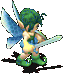

---
layout:
  title:
    visible: true
  description:
    visible: true
  tableOfContents:
    visible: true
  outline:
    visible: true
  pagination:
    visible: false
---

# 特色宠物

<mark style="color:red;">**注意：本服所有改造宠、特色宠和商城宠均为135档**</mark>\ <mark style="color:red;">**种族固定、档位随机**</mark>\ <mark style="color:red;">**改造宠和特色宠随机获得以下任意1个档位分布**</mark>\
<mark style="color:red;">血攻：50.50.5.25.5</mark>\ <mark style="color:red;">攻敏：35.50.5.40.5</mark>\ <mark style="color:red;">血防魔：40.5.35.5.50</mark>\ <mark style="color:red;">敏魔：25.5.5.50.50</mark>\ <mark style="color:red;">血防：50.30.40.10.5</mark>\
<mark style="color:red;">**改造成功会额外随机自带技能\*1  默认四修正5点**</mark>\ <mark style="color:red;">**可获得技能（均可提取）：**</mark>\
<mark style="color:green;">气功弹、单体补血、超强陨石/冰冻/火焰/风刃魔法超强补血、洁净魔法、超强恢复、迅速果断、气绝恢复</mark>\

<table data-header-hidden><thead><tr><th width="145"></th><th></th></tr></thead><tbody><tr><td> </td><td>                                                                 <strong>任务宠物</strong></td></tr><tr><td>  </td><td></td></tr><tr><td></td><td><mark style="color:red;"><strong>剑盾精灵</strong></mark>|人形系|地50水50|120D|37.30.30.12.11|反击5| 技能栏7|连击4级、护卫4级 <mark style="color:purple;"><strong>获取方式&#x3C;&#x3C;国民任务>></strong></mark></td></tr><tr><td></td><td><mark style="color:red;"><strong>战斧精灵</strong></mark>|人形系|火50风50|120D|30.38.17.24.11|必杀5| 技能栏7|诸刃4级、崩击4级 <mark style="color:purple;"><strong>获取方式&#x3C;&#x3C;国民任务>></strong></mark></td></tr><tr><td></td><td><mark style="color:red;"><strong>元素精灵</strong></mark>|人形系|地50风50|115D|20.14.23.25.33|闪躲5| 技能栏7|单体补血4级、圣盾4级 <mark style="color:purple;"><strong>获取方式&#x3C;&#x3C;国民任务>></strong></mark></td></tr><tr><td></td><td><mark style="color:red;"><strong>炎斗精灵</strong></mark>|人形系|水50风50|115D|17.42.20.24.12|命中5| 技能栏7|气功弹4级、阳炎4级 <mark style="color:purple;"><strong>获取方式&#x3C;&#x3C;国民任务>></strong></mark></td></tr><tr><td> </td><td></td></tr><tr><td></td><td></td></tr></tbody></table>

\
\

<table data-header-hidden><thead><tr><th width="144"></th><th></th></tr></thead><tbody><tr><td> </td><td>                                                                        <strong>改造宠物</strong></td></tr><tr><td></td><td>                                                     <a href="http://www.douyaml.com/forum.php?mod=viewthread&#x26;tid=235">&#x3C;宠物设计图如何获得点击查看></a>                                     <a href="http://www.douyaml.com/forum.php?mod=viewthread&#x26;tid=275">&#x3C;宠物改造所需1级宠物捕捉点/获得方法 点击查看></a></td></tr><tr><td></td><td>                                                          <mark style="color:purple;">竞技场连战改造</mark>                                       <mark style="color:purple;"><strong>集齐所需改图和宠物后双击改图即可完成改造</strong></mark></td></tr><tr><td></td><td> <mark style="color:red;"><strong>皮神</strong></mark>|次元系|火20风80| 技能栏10|魔法无效Lv4（不可提取） <mark style="color:blue;"><strong>改造配方</strong></mark>|皮卡丘Lv1+皮神改造图A-E（竞技场&#x3C;超难>连战获得）  </td></tr><tr><td></td><td> <mark style="color:red;"><strong>月兔</strong></mark>|次元系|地25水25火25风25| 技能栏8|超强火焰Lv1+超强冰冻Lv1+超强风刃Lv1+超强陨石Lv1+气功弹Lv1 <mark style="color:blue;"><strong>改造配方</strong></mark>|天使恶魔Lv1+暗影炸弹Lv1+月兔改造图A-E（竞技场&#x3C;超难>连战获得） <mark style="color:purple;"><strong>注：技能可提取</strong></mark> </td></tr><tr><td></td><td> <mark style="color:red;"><strong>魔法兔</strong></mark>|次元系|地25水25火25风25| 技能栏10|吸血魔法Lv5（不可提取） <mark style="color:blue;"><strong>改造配方</strong></mark>|月兔改造20%几率变异获得  </td></tr><tr><td></td><td> <mark style="color:red;"><strong>暴力兔</strong></mark>|次元系|地25水25火25风25| 技能栏10|戒骄戒躁Lv5（不可提取） <mark style="color:blue;"><strong>改造配方</strong></mark>|月兔改造20%几率变异获得  </td></tr><tr><td></td><td>                                                                    <strong>飞行系</strong></td></tr><tr><td></td><td>  <mark style="color:red;"><strong>天使恶魔</strong></mark>|火80风20|技能栏8 <mark style="color:blue;"><strong>改造配方</strong></mark>|小石像怪Lv1+水蓝鸟魔Lv1+小恶魔Lv1+迷你石像怪Lv1+飞行系设计图*5</td></tr><tr><td></td><td></td></tr><tr><td></td><td>  <mark style="color:red;"><strong>果冻蝙蝠</strong></mark>|水80火20|技能栏8 <mark style="color:blue;"><strong>改造配方</strong></mark>|扫把蝙蝠Lv1+迷你蝙蝠Lv1+水果蝙蝠Lv1+小蝙蝠Lv1+飞行系设计图*5  </td></tr><tr><td></td><td><mark style="color:red;"><strong>草原蝙蝠</strong></mark>|地80风20|技能栏8 <mark style="color:blue;"><strong>改造配方</strong></mark>|巨蝙蝠Lv1+海蝙蝠Lv1+胖蝙蝠Lv1+兔耳蝙蝠Lv1+飞行系设计图*5</td></tr><tr><td></td><td></td></tr><tr><td></td><td><mark style="color:red;"><strong>暗翼恶魔</strong></mark>|火40风60||技能栏8 <mark style="color:blue;"><strong>改造配方</strong></mark>|石像怪Lv1+血魔Lv1+堕天使Lv1+恶魔Lv1+飞行系设计图*5</td></tr><tr><td></td><td></td></tr><tr><td></td><td>                                                              <strong>野兽系</strong></td></tr><tr><td></td><td><mark style="color:red;"><strong>梦境鼠</strong></mark>|火80风20|技能栏8 <mark style="color:blue;"><strong>改造配方</strong></mark>|大地鼠Lv1+火焰鼠Lv1+宝石鼠Lv1噩梦鼠Lv1+野兽系设计图*5</td></tr><tr><td></td><td></td></tr><tr><td></td><td><mark style="color:red;"><strong>暗罗刹</strong></mark>|地50水50|技能栏8 <mark style="color:blue;"><strong>改造配方</strong></mark>|恶魔猫Lv1+猫人Lv1+罗刹Lv1+妖狐Lv1+野兽系设计图*5</td></tr><tr><td></td><td></td></tr><tr><td></td><td><mark style="color:red;"><strong>远古龟</strong></mark>|地80风20|技能栏8 <mark style="color:blue;"><strong>改造配方</strong></mark>|硬壳龟Lv1+地底龟Lv1+火焰龟Lv1+海底龟Lv1+野兽系设计图*5</td></tr><tr><td></td><td></td></tr><tr><td></td><td><mark style="color:red;"><strong>赤金熊王</strong></mark>|水30火70|技能栏8 <mark style="color:blue;"><strong>改造配方</strong></mark>|北极熊Lv1+穴熊Lv1+赤目黑熊Lv1+赤熊Lv1+野兽系设计图*5</td></tr><tr><td></td><td></td></tr><tr><td></td><td><mark style="color:red;"><strong>暗黑魔狼</strong></mark>|火90风10|技能栏8 <mark style="color:blue;"><strong>改造配方</strong></mark>|地狱看门犬Lv1+地狱猎犬Lv1+地狱妖犬Lv1+巨狼Lv1+野兽系设计图*5</td></tr><tr><td></td><td></td></tr><tr><td></td><td>                                                                 <strong>不死系</strong></td></tr><tr><td></td><td><mark style="color:red;"><strong>牙好胃口好</strong></mark>|火40风60|技能栏8 <mark style="color:blue;"><strong>改造配方</strong></mark>|牙骨Lv1+鄂牙Lv1+巨牙Lv1+利牙Lv1+不死系设计图*5</td></tr><tr><td></td><td></td></tr><tr><td></td><td><mark style="color:red;"><strong>梦鬼灵</strong></mark>|地90水10|技能栏8 <mark style="color:blue;"><strong>改造配方</strong></mark>|鬼灵Lv1+死灵Lv1+幽灵Lv1+亡灵Lv1+不死系设计图*5</td></tr><tr><td></td><td></td></tr><tr><td></td><td><mark style="color:red;"><strong>暗夜木乃伊</strong></mark>|地60风40|技能栏8 <mark style="color:blue;"><strong>改造配方</strong></mark>|木乃伊Lv1+丧尸Lv1+腐尸Lv1+食尸鬼Lv1+不死系设计图*5</td></tr><tr><td></td><td></td></tr><tr><td></td><td><mark style="color:red;"><strong>骷髅战神</strong></mark>|地30风70|技能栏8 <mark style="color:blue;"><strong>改造配方</strong></mark>|武装骷髅Lv1+骷髅战士Lv1+地狱骷髅Lv1+血骷髅Lv1+不死系设计图*5</td></tr><tr><td></td><td></td></tr><tr><td></td><td>                                                             <strong>昆虫系</strong></td></tr><tr><td></td><td><mark style="color:red;"><strong>草原蝎</strong></mark>|地90水10|技能栏8 <mark style="color:blue;"><strong>改造配方</strong></mark>|蓝蝎Lv1+杀手蝎Lv1+红蝎Lv1+黄蝎Lv1+昆虫系设计图*5</td></tr><tr><td></td><td></td></tr><tr><td></td><td><mark style="color:red;"><strong>螳螂王</strong></mark>|地70风30|技能栏8 <mark style="color:blue;"><strong>改造配方</strong></mark>|致命螳螂Lv1+死灰螳螂Lv1+杀人螳螂Lv1+赤目螳螂Lv1+昆虫系设计图*5</td></tr><tr><td></td><td></td></tr><tr><td></td><td><mark style="color:red;"><strong>影蛛</strong></mark>|水50火50|技能栏8 <mark style="color:blue;"><strong>改造配方</strong></mark>|土蜘蛛Lv1+水蜘蛛Lv1+火蜘蛛Lv1+风蜘蛛Lv1+昆虫系设计图*5</td></tr><tr><td></td><td></td></tr><tr><td></td><td><mark style="color:red;"><strong>影蜂</strong></mark>|地20风80|技能栏8 <mark style="color:blue;"><strong>改造配方</strong></mark>|杀人蜂Lv1+死亡蜂Lv1+虎头蜂Lv1+异性蜂Lv1+昆虫系设计图*5</td></tr><tr><td></td><td></td></tr><tr><td></td><td>                                                        <strong>人形系</strong></td></tr><tr><td></td><td><mark style="color:red;"><strong>赤翼</strong></mark>|火60风40|技能栏8 <mark style="color:blue;"><strong>改造配方</strong></mark>|幻歌妖Lv1+狠毒鸟人Lv1+烈风鸟Lv1+黑暗鸟人Lv1+人形系设计图*5</td></tr><tr><td></td><td></td></tr><tr><td></td><td>
<mark style="color:red;"><strong>古惑仔</strong></mark>|水50火50|技能栏8 <mark style="color:blue;"><strong>改造配方</strong></mark>|哥布林Lv1+红帽哥布林Lv1+火焰哥布林Lv1+烈风哥布林Lv1+人系设计图

*5
</td></tr><tr><td></td><td></td></tr><tr><td></td><td><mark style="color:red;"><strong>猪皇</strong></mark>|火50风50|技能栏8 <mark style="color:blue;"><strong>改造配方</strong></mark>|猪鬼Lv1+钢鬼Lv1+半兽人Lv1+大型半兽人Lv1+人形系设计图*5</td></tr><tr><td></td><td></td></tr><tr><td></td><td><mark style="color:red;"><strong>远古巨人</strong></mark>|地80风20|技能栏8 <mark style="color:blue;"><strong>改造配方</strong></mark>|巨人Lv1+单眼巨人Lv1+泰坦巨人Lv1+亚特拉斯巨神Lv1+人形系设计图*5</td></tr><tr><td></td><td></td></tr><tr><td></td><td>                                                    <strong>植物系</strong></td></tr><tr><td></td><td><mark style="color:red;"><strong>草木之灵</strong></mark>|地80风20|技能栏8 <mark style="color:blue;"><strong>改造配方</strong></mark>|妖草Lv1+人魔草Lv1+妖花Lv1+曼陀罗草Lv1+植物系设计图*5</td></tr><tr><td></td><td><mark style="color:red;"><strong>灵芝菇</strong></mark>|水80火20|技能栏8 <mark style="color:blue;"><strong>改造配方</strong></mark>|粉红菇Lv1+翠绿菇Lv1+星菇Lv1+水蓝菇Lv1+植物系设计图*5</td></tr><tr><td></td><td><mark style="color:red;"><strong>多金口臭佬</strong></mark>|地40风60|技能栏8 <mark style="color:blue;"><strong>改造配方</strong></mark>|绿色口臭Lv1+黄色口臭Lv1+红色口臭Lv1+蓝色口臭Lv1+植物系设计图*5</td></tr><tr><td></td><td><mark style="color:red;"><strong>容嬷嬷</strong></mark>|水70火30|技能栏8 <mark style="color:blue;"><strong>改造配方</strong></mark>|凶暴仙人掌Lv1+印第安仙人掌Lv1+兔耳仙人掌Lv1+武术仙人掌Lv1+植物系设计图*5</td></tr><tr><td></td><td><mark style="color:red;"><strong>暗影树妖</strong></mark>|地60水40|技能栏8 <mark style="color:blue;"><strong>改造配方</strong></mark>|黄金树精Lv1+死亡树精Lv1+惨白树精Lv1+冰冷树精Lv1+植物系设计图*5</td></tr><tr><td></td><td></td></tr><tr><td></td><td>                                                                 <strong>特殊系</strong></td></tr><tr><td></td><td><mark style="color:red;"><strong>暗黑棉花糖</strong></mark>|地20风80|技能栏8 <mark style="color:blue;"><strong>改造配方</strong></mark>|烟雾Lv1+绿烟Lv1+烟罗Lv1+棉球Lv1+特殊系设计图*5</td></tr><tr><td></td><td></td></tr><tr><td></td><td><mark style="color:red;"><strong>纯白史莱姆</strong></mark>|地20水80|技能栏8 <mark style="color:blue;"><strong>改造配方</strong></mark>|史莱姆Lv1+液态Lv1+果冻史莱姆Lv1+布丁史莱姆Lv1+特殊系设计图*5</td></tr><tr><td></td><td></td></tr><tr><td></td><td><mark style="color:red;"><strong>幻精</strong></mark>|地25水25火25风25|技能栏9 <mark style="color:blue;"><strong>改造配方</strong></mark>|地精Lv1+水精Lv1+火精Lv1+风精Lv1+特殊系设计图*5</td></tr><tr><td></td><td></td></tr><tr><td></td><td><mark style="color:red;"><strong>暗影炸弹</strong></mark>|水80火20|技能栏8 <mark style="color:blue;"><strong>改造配方</strong></mark>|宝贝炸弹Lv1+顽皮炸弹Lv1+大炸弹Lv1+漂浮炸弹Lv1+特殊系设计图*5</td></tr><tr><td></td><td></td></tr><tr><td></td><td>                                           <strong>龙系</strong></td></tr><tr><td></td><td><mark style="color:red;"><strong>龙呆呆</strong></mark>|火70风30|技能栏8 <mark style="color:blue;"><strong>改造配方</strong></mark>|口袋龙Lv1+穴龙Lv1+迷你龙Lv1+雏龙Lv1+龙系设计图*5 </td></tr><tr><td></td><td><mark style="color:red;"><strong>蜴形</strong></mark>|地60水40|技能栏8 <mark style="color:blue;"><strong>改造配方</strong></mark>|蜥蜴战士Lv1+蜥蜴斗士Lv1+蜥蜴武士Lv1+猎豹蜥蜴Lv1+龙系设计图*5</td></tr><tr><td></td><td></td></tr><tr><td></td><td><mark style="color:red;"><strong>圣龙蜥</strong></mark>|水60火40|技能栏8 <mark style="color:blue;"><strong>改造配方</strong></mark>|地龙蜥Lv1+水龙蜥Lv1+火龙蜥Lv1+风龙蜥Lv1+龙系设计图*5 </td></tr><tr><td></td><td><mark style="color:red;"><strong>夜煞</strong></mark>|地80风20|技能栏8 <mark style="color:blue;"><strong>改造配方</strong></mark>|大地翼龙Lv1+寒冰翼龙Lv1+火焰翼龙Lv1+烈风翼龙Lv1+龙系设计图*5</td></tr><tr><td></td><td>                                                                  <strong>金属系</strong></td></tr><tr><td></td><td><mark style="color:red;"><strong>岩魔</strong></mark>|地90风10|技能栏8 <mark style="color:blue;"><strong>改造配方</strong></mark>|岩怪Lv1+熔岩Lv1+影岩Lv1+爆岩Lv1+金属系设计图*5</td></tr><tr><td></td><td></td></tr><tr><td></td><td><mark style="color:red;"><strong>星云</strong></mark>|地10水90|技能栏8 <mark style="color:blue;"><strong>改造配方</strong></mark>|血腥之刃Lv1+火焰之刃Lv1+杀龙之刃Lv1+烈风之刃Lv1+金属系设计图*5</td></tr><tr><td></td><td></td></tr><tr><td></td><td><mark style="color:red;"><strong>剧毒螃蟹</strong></mark>|地80水20|技能栏8 <mark style="color:blue;"><strong>改造配方</strong></mark>|恶魔螃蟹Lv1+水晶螃蟹Lv1+铁钳螃蟹Lv1+黄金螃蟹Lv1+金属系设计图*5</td></tr><tr><td></td><td></td></tr><tr><td></td><td><mark style="color:red;"><strong>弑神</strong></mark>|火40风60|技能栏8 <mark style="color:blue;"><strong>改造配方</strong></mark>|血腥之刃Lv1+火焰之刃Lv1+杀龙之刃Lv1+烈风之刃Lv1+金属系设计图*5</td></tr><tr><td></td><td></td></tr><tr><td></td><td><mark style="color:red;"><strong>天使之盾</strong></mark>|地80风20|技能栏8 <mark style="color:blue;"><strong>改造配方</strong></mark>|神盾Lv1+强盾Lv1+潜盾Lv1+盾Lv1+金属系设计图*5</td></tr><tr><td></td><td></td></tr><tr><td></td><td>                                                      <strong>次元系</strong></td></tr><tr><td></td><td><mark style="color:red;"><strong>初音·未来</strong></mark>|水100|技能栏9 <mark style="color:blue;"><strong>改造配方</strong></mark>|镰刀魔Lv1+斩首者Lv1+独角兽Lv1+天马Lv1+次元系设计图*10 <mark style="color:green;"><strong>自带技能</strong></mark>|超强补血魔法3级（可提取技能） </td></tr><tr><td> </td><td></td></tr></tbody></table>

\
\
\

<table data-header-hidden><thead><tr><th width="145"></th><th></th></tr></thead><tbody><tr><td> </td><td>                                                    <strong>◆  拟态  ◆  商城宠物  ◆</strong></td></tr><tr><td></td><td></td></tr><tr><td><strong>▲</strong><mark style="color:red;"><strong>宠物简介</strong></mark><strong>▲</strong></td><td><mark style="color:red;"><strong>种族：</strong>次元系</mark>   <a href="http://www.douyaml.com/forum.php?mod=viewthread&#x26;tid=233"><mark style="color:red;"><strong>&#x3C;点击查看种族克制表></strong></mark></a> <mark style="color:red;"><strong>商城宠物特点①：每周随机刷新宠物种族1次，可任意切换</strong></mark> <mark style="color:red;"><strong>商城宠物特点②：每周随机刷新宠物形象1次， 可任意切换</strong></mark> <mark style="color:red;"><strong>商城宠物特点③：每周随机刷新宠物元素属性1次，可任意切换</strong></mark> <mark style="color:red;"><strong>宠物档位选择方案：血攻/敏攻/防魔/敏魔/血防</strong></mark></td></tr><tr><td> </td><td></td></tr><tr><td> </td><td></td></tr><tr><td> <strong>388点商城点</strong> </td><td>
<mark style="color:green;"><strong>拟态Ⅹ型</strong></mark> <mark style="color:green;">技能栏10|自带技能气功弹3级（3级3个蛋）|超强补血3级(不可提取)</mark> <mark style="color:green;">初始元素|地25水25火25风25</mark> <mark style="color:green;">初始种族|次元系</mark> <mark style="color:green;">初始修正|5闪5命5必5反</mark> <mark style="color:green;">宠物形象|每周随机所有3.7版本的宠物形象（含BOSS形象）</mark>  <mark style="color:purple;"><strong>档位分配方案</strong></mark><strong>|</strong>(<mark style="color:orange;">选择后不可更改</mark>) <mark style="color:red;">血攻：50.50.5.25.5</mark>

<mark style="color:red;">攻敏：35.50.5.40.5</mark>

<mark style="color:red;">血防魔：40.5.35.5.50</mark>

<mark style="color:red;">敏魔：25.5.5.50.50</mark>

<mark style="color:red;">血防：50.30.40.10.5</mark> <mark style="color:red;">每周随机刷新宠物种族/形象/元素属性/各1次 <strong>（每次刷新2个可选项）</strong></mark>
</td></tr><tr><td> </td><td> </td></tr><tr><td> <strong>588商城点</strong> </td><td>
<mark style="color:green;"><strong>拟态操控者</strong></mark> <mark style="color:green;">技能栏10|自带技能气功弹4级（4级4个蛋）|超强补血4级|</mark> <mark style="color:green;">初始元素|地25水25火25风25</mark> <mark style="color:green;">初始种族|次元系</mark> <mark style="color:green;">初始修正|8闪8命8必8反</mark> <mark style="color:green;">宠物形象|每周随机所有3.7和6.0版本的宠物（含BOSS形象、人物形象及变色人物形象）</mark>  <mark style="color:purple;"><strong>档位分配方案</strong></mark><strong>|</strong>(<mark style="color:orange;">选择后不可更改</mark>) <mark style="color:red;">血攻：50.50.5.25.5</mark> <mark style="color:red;">攻敏：35.50.5.40.5</mark> <mark style="color:red;">血防魔：40.5.35.5.50</mark> <mark style="color:red;">敏魔：25.5.5.50.50</mark> <mark style="color:red;">血防：50.30.40.10.5</mark>

<mark style="color:red;">每周随机刷新宠物种族/形象/元素属性/各1次<strong>（每次刷新3个可选项）</strong></mark> 
</td></tr><tr><td><mark style="color:red;"><strong>拟态生物使用指南</strong></mark></td><td><mark style="color:orange;">购买后选择初始档位分配（选择后不可更改）</mark> <mark style="color:orange;">获得宠物后,点击右侧按键"便捷功能"选择"宠物拟态"进入操作界面</mark> <mark style="color:orange;">刷新可拟态形象和可拟态元素分配方案（可拟态形象达到几百个之多）</mark> <mark style="color:orange;">每过周日晚上12点即可再次刷新拟态方案！</mark> <mark style="color:orange;">拟态后可还原形象、种族、元素属性（如果想保持当前形象 可以刷新不选择即可）</mark></td></tr></tbody></table>
