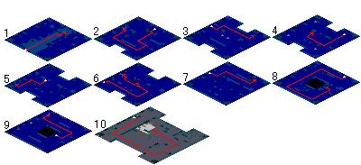
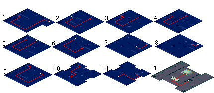
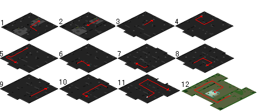
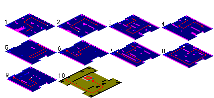
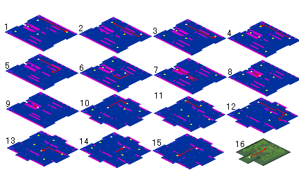

# 战斗系阶级提升III(双王)

<table><thead><tr><th width="124" align="center">起始地點</th><th width="211">阿巴尼斯村民家</th><th width="111" align="center">頭目戰</th><th>○</th></tr></thead><tbody><tr><td align="center">必要條件</td><td>具備<a href="kai-qi-zhe.md">開啟者</a>稱號</td><td align="center">必要等級</td><td>---</td></tr><tr><td align="center">職業限定</td><td>王宮階級以上</td><td align="center">建議等級</td><td>LV65</td></tr><tr><td align="center">時間限制</td><td>---</td><td align="center">重複完成</td><td>○</td></tr><tr><td align="center">任務獎賞</td><td>戰鬥系(含醫生、護士)職業晉級師範/御用資格</td><td align="center"></td><td></td></tr></tbody></table>

1.到阿巴尼斯村民家(40,30)跟歷史學家雷伯爾森(14,10)說話，得到"野草莓"，把野草莓交給樓梯前的米希安(9,4)就可進入民家地下

2.調查連接時空的石盤(15,7)傳送至過去，跟戰士帕魯凱斯(15,7)交談拿取"刀刃的碎片"

3.帶著"刀刃的碎片"上樓跟歷史學家雷波雷翁(14,10)說話；再回到民家地下調查連接時空的石盤(15,10)傳送回現代\
☆與歷史學家的對話可省略

4.出阿巴尼斯村往西走到(54,162)，調查鼓動的石盤進入詛咒的迷宮\
<mark style="color:red;">**☆沒有"刀刃的碎片"無法進入**</mark>

| 
詛咒的迷宮地下第01樓到第10樓 
 |
| --------------------------- |

<figure><figcaption></figcaption></figure>

5.在第10層抵達第一個難關，與納帕(22,14)說話進入戰鬥

<table><thead><tr><th width="117">名字</th><th width="76">數量</th><th width="76">等級</th><th width="127">血量(預估值)</th><th width="87">屬性</th><th>使用技能</th></tr></thead><tbody><tr><td>納帕</td><td>1</td><td>65</td><td>6000</td><td> </td><td>攻擊、聖盾、召喚大地翼龍(二次行動)</td></tr><tr><td>地獄獵犬</td><td>4</td><td>40</td><td> </td><td>火6風4</td><td>攻擊、防禦、召喚地獄獵犬</td></tr><tr><td>大地翼龍</td><td>5</td><td>40</td><td> </td><td>地10</td><td>攻擊、防禦、毒性攻擊</td></tr></tbody></table>

獲勝後跟納帕說話拿取"聖詔之一"，使用後傳送到詛咒的迷宮第11層\
<mark style="color:orange;">**☆封印師、馴獸師、飼養師有專職技能R8，不用打納帕便可以直接通過，但不會得到"聖詔之一"**</mark>

| 
詛咒的迷宮地下第11樓到第20樓 
 |
| --------------------------- |

<figure><figcaption></figcaption></figure>

6.在第20層到達第二個難關，與德爾麥(26,17)說話進入戰鬥

<table><thead><tr><th width="100">名字</th><th width="66">數量</th><th width="68">等級</th><th width="124">血量(預估值)</th><th width="90">屬性</th><th>使用技能</th></tr></thead><tbody><tr><td>德爾麥</td><td>1</td><td>65</td><td>7000</td><td> </td><td>攻擊、聖盾、超強隕石魔法、超強冰凍魔法、超強火焰魔法、超強風刃魔法、攻擊吸收、攻擊反彈、攻擊無效(二次行動)</td></tr><tr><td>羅剎</td><td>4</td><td>43</td><td> </td><td>水3火7</td><td>攻擊、防禦、強力火焰魔法、超強火焰魔法</td></tr><tr><td>血腥之刃</td><td>5</td><td>43</td><td> </td><td>地9水1</td><td>攻擊、防禦、攻擊吸收、攻擊反彈、攻擊無效</td></tr></tbody></table>

獲勝後與德爾麥說話得到"聖詔之二"，使用後傳送到詛咒的迷宮第21層\
<mark style="color:orange;">**☆魔法師有任何一種專職技能R8，不用打德爾麥便可以直接通過，但不會得到"聖詔之二"**</mark>

| 
詛咒的迷宮地下第21樓到第30樓 
 |
| --------------------------- |

<figure><figcaption></figcaption></figure>

7.在第30層到達第三個難關，與瑟貝塔(20,21)交談進入戰鬥

<table><thead><tr><th width="100">名字</th><th width="68">數量</th><th width="78">等級</th><th width="123">血量(預估值)</th><th width="91">屬性</th><th>使用技能</th></tr></thead><tbody><tr><td>瑟貝塔</td><td>1</td><td>65</td><td>7000</td><td> </td><td>攻擊、連擊、諸刃、反擊、聖盾、魔法吸收、魔法反彈、魔法無效(二次行動)</td></tr><tr><td>蜥蝪鬥士</td><td>4</td><td>46</td><td> </td><td>地3水7</td><td>攻擊、防禦、連擊</td></tr><tr><td>獵豹蜥蝪</td><td>5</td><td>46</td><td> </td><td>火3風7</td><td>攻擊、防禦、魔法吸收、魔法反彈、魔法無效</td></tr></tbody></table>

戰勝後跟瑟貝塔談話得到"聖詔之三"，使用後可以直接傳送到詛咒的迷宮第31層\
<mark style="color:orange;">**☆劍士、戰鬥斧士、騎士、弓箭手有任何一種戰鬥技能R8、格鬥士有任何一種戰鬥技能R8、忍者有暗殺技能R8，不用打瑟貝塔便可以直接通過，但不會得到"聖詔之三；3.0以後的技能無法被接受"**</mark>

| 
詛咒的迷宮地下第31樓到第40樓 
 |
| --------------------------- |

<figure><figcaption></figcaption></figure>

8.在第40層抵達第四個難關，與亞爾法說話進入戰鬥

<table><thead><tr><th width="100">名字</th><th width="66">數量</th><th width="64">等級</th><th width="126">血量(預估值)</th><th width="88">屬性</th><th>使用技能</th></tr></thead><tbody><tr><td>亞爾法</td><td>1</td><td>65</td><td>6000</td><td> </td><td>攻擊、聖盾、補血魔法、強力補血魔法、超強補血魔法、恢復魔法、強力恢復魔法、超強恢復魔法、潔淨魔法(二次行動)</td></tr><tr><td>迷你石像怪</td><td>4</td><td>49</td><td> </td><td>火3風7</td><td>攻擊、防禦、攻擊魔法防禦、強力補血魔法、超強補血魔法</td></tr><tr><td>寶貝炸彈</td><td>5</td><td>49</td><td> </td><td>水8火2</td><td>攻擊、防禦、強力恢復魔法</td></tr></tbody></table>

戰勝後跟亞爾法說話取得"聖詔之四"，使用之後可以直接傳送到第41層\
<mark style="color:orange;">**☆傳教士、巫師有任何一種專業技能R8，不用打亞爾法便可以直接通過，但不會得到"聖詔之四"**</mark>

| 
詛咒的迷宮地下第41樓到第50樓 
 |
| --------------------------- |

<figure><figcaption></figcaption></figure>

9.在第50層到達第五個難關"，與馬帝亞交談進入戰鬥\
<mark style="color:orange;">**☆咒術或抗咒術R8，以及攻擊或魔法的吸收、反彈或無效的魔法R8都可以直接通過。**</mark>

<table><thead><tr><th width="111">名字</th><th width="65">數量</th><th width="68">等級</th><th width="125">血量(預估值)</th><th width="87">屬性</th><th>使用技能</th></tr></thead><tbody><tr><td>馬帝亞</td><td>1</td><td>65</td><td>8000</td><td> </td><td>攻擊、聖盾、超強中毒魔法、超強昏睡魔法、超強石化魔法、超強酒醉魔法、超強混亂魔法、超強遺忘魔法(二次行動)</td></tr><tr><td>幽靈</td><td>4</td><td>52</td><td> </td><td>地2水8</td><td>攻擊、防禦、強力昏睡魔法</td></tr><tr><td>兇暴仙人掌</td><td>5</td><td>52</td><td> </td><td>風5地5</td><td>攻擊、防禦、強力遺忘魔法</td></tr></tbody></table>

\

| 
詛咒的迷宮地下第51樓到第60樓 
 |
| --------------------------- |

<figure><figcaption></figcaption></figure>

10.在第60層到達第六個難關，調查封印石(24,19)進入戰鬥

<table><thead><tr><th width="100">名字</th><th width="70">數量</th><th width="74">等級</th><th width="135">血量(預估值)</th><th width="75">屬性</th><th>使用技能</th></tr></thead><tbody><tr><td>凱法</td><td>1</td><td>70</td><td>11000</td><td> </td><td>攻擊、連擊、諸刃、乾坤一擲、崩擊、吸血攻擊、魔法無效、魔法封印(打倒帕布提斯馬追加)(二次行動)</td></tr><tr><td>帕布提斯馬</td><td>1</td><td>70</td><td>11000</td><td> </td><td>超強隕石魔法、超強冰凍魔法、超強火焰魔法、超強風刃魔法、攻擊無效、超強即死魔法(打倒凱法追加)(二次行動)</td></tr></tbody></table>

戰勝後跟神官貝米烏斯(21,12)說話，戰鬥系職業可得到提升階級的資格

11.攜帶20000G跟一開始就職的NPC交談即可提昇階級
