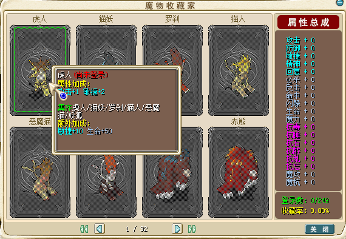

---
layout:
  title:
    visible: true
  description:
    visible: true
  tableOfContents:
    visible: true
  outline:
    visible: true
  pagination:
    visible: false
---

# ❗ 宠物收藏系统

<mark style="color:green;">**本服重新设计了宠物收藏系统，使其的能力有增有减，请玩家自行取舍。**</mark>\ <mark style="color:green;">**在主线任务或各种活动会提供常见部分的宠物魔物结晶，但是不常见和稀有的所有宠物需要由召唤师玩家捕捉，用以平衡完全不玩召唤师和只玩召唤师的玩家。玩家可以通过**</mark><mark style="color:red;">**本服特色拍卖系统**</mark><mark style="color:green;">**进行魔物结晶的交易或直接交易宠物**</mark>

<table data-header-hidden><thead><tr><th width="169" align="center"></th><th></th></tr></thead><tbody><tr><td align="center"><strong>简  介</strong></td><td></td></tr><tr><td align="center"><strong>使用说明</strong></td><td> </td></tr><tr><td align="center"><strong>1</strong></td><td>右侧便捷菜单点击&#x3C;魔物收藏>可以查看列表 和已收藏情况</td></tr><tr><td align="center"><strong>2</strong></td><td>前往&#x3C;元素大殿>找NPC魔物收藏家可以提交未收藏的1级宠物(8D以内)</td></tr><tr><td align="center"><strong>3</strong></td><td>上交符合要求的宠物后，可以获得对应的魔物结晶</td></tr><tr><td align="center"><strong>4</strong></td><td>魔物结晶不可交易但可上拍卖系统</td></tr><tr><td align="center"><strong>5</strong></td><td>集齐某系列宠物后会获得，额外加成</td></tr><tr><td align="center"><mark style="color:red;"><strong>注意</strong></mark></td><td><mark style="color:red;"><strong>每种宠物只能收藏1只、且能力有增有减，请玩家自行取舍</strong></mark></td></tr></tbody></table>

