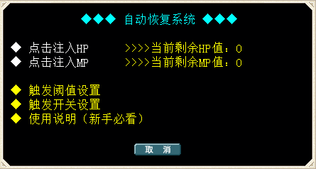

---
layout:
  title:
    visible: true
  description:
    visible: true
  tableOfContents:
    visible: true
  outline:
    visible: true
  pagination:
    visible: false
---

# 🚩 血魔池（战斗后自动回复）

<table data-header-hidden><thead><tr><th width="159" align="center"></th><th></th></tr></thead><tbody><tr><td align="center"> </td><td></td></tr><tr><td align="center"><strong>激活方法</strong></td><td>点击游戏右侧边"<strong>功能面板</strong>"的"血魔池"按键</td></tr><tr><td align="center"><strong>简    介</strong></td><td></td></tr><tr><td align="center"><strong>注入方法</strong></td><td>把料理血瓶或者打包成箱放在物品栏第一格后"点击注入"</td></tr><tr><td align="center"><strong>注入比例</strong></td><td>1级35% 2级40% 3级45% 4级50% 5级55% 6级60% 7级65% 8级70% 9级75% 10级80%</td></tr><tr><td align="center"> </td><td></td></tr><tr><td align="center"><strong>阈值设置</strong></td><td>可以设置HP/MP剩余20%~80%之间开始恢复，如果设置0则全部关闭</td></tr><tr><td align="center"><strong>触发开关设置</strong></td><td>可以单独设置人物和宠物的HP和MP是否战斗后恢复 每次重新上线也会保留之前的设置</td></tr></tbody></table>
