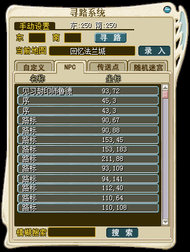
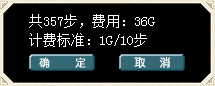

---
layout:
  title:
    visible: true
  description:
    visible: true
  tableOfContents:
    visible: true
  outline:
    visible: true
  pagination:
    visible: false
---

# 🚩 自动寻路功能

<table data-header-hidden><thead><tr><th width="179" align="center"></th><th></th></tr></thead><tbody><tr><td align="center"><strong>自定义坐标</strong></td><td><mark style="color:red;"><strong>支持</strong></mark></td></tr><tr><td align="center"><strong>寻找NPC</strong></td><td><mark style="color:red;"><strong>支持</strong></mark></td></tr><tr><td align="center"><strong>寻找传送点</strong></td><td><mark style="color:red;"><strong>支持</strong></mark></td></tr><tr><td align="center"><strong>迷宫导航</strong></td><td><mark style="color:red;"><strong>支持</strong></mark></td></tr><tr><td align="center"><strong>迷宫导航费用</strong></td><td>每次开启消耗[30]魔币</td></tr><tr><td align="center"><strong>寻路步数费用</strong></td><td>使用自动寻路每10步收费1魔币</td></tr><tr><td align="center"><strong>使用方法</strong></td><td>游戏中可以点击Ctrl+S 快捷打开地图</td></tr><tr><td align="center"> </td><td></td></tr><tr><td align="center"> </td><td></td></tr></tbody></table>
